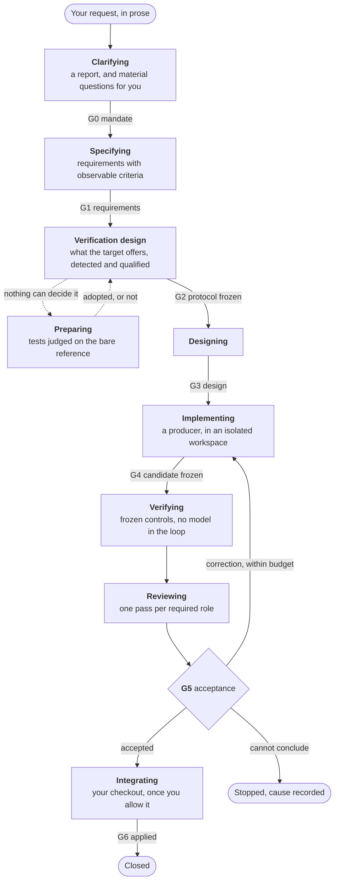

<p align="center">
   <b>495 — an evidence-gated harness for coding agents, inside Pi</b><br>
   <sub>The checks that judge a change are frozen before the change exists.<br>
   No agent gets to say its own work is done.</sub>
</p>

<br>

<p align="center">

[](LICENSE)
[](https://github.com/badlogic/pi-mono)
[](https://nodejs.org/)
[](#technologies-models-and-platforms)
[](#models)
[](#platforms)


</p>

<br>

**495 carries a software change from a request in prose to a candidate you can integrate, and it
only lets that change through on evidence it executed itself.** You type the request into Pi. 495
has it specified, writes the tests and freezes the checks that will decide the change *before*
anything is produced, has the change written in a workspace of its own, runs those checks with no
model in the loop, and concludes on what they reported.

An agent proposes. The kernel decides from executed checks. You arbitrate, through Pi's own
dialogues. Every requirement, decision, intervention and piece of evidence is recorded and can be
read back offline.

495 is a **pi-package**. It ships no CLI, no service and no CI job of its own: Pi loads it, and
every surface it has is a Pi surface.


## Why 495?

495 is the three-digit ***Kaprekar constant***: a fixed point reached by repeatedly applying a
simple, deterministic rule to many different starting states. Explore the step-by-step process at
[6174.co.uk/495](https://www.6174.co.uk/495).

The name reflects 495's purpose: apply explicit rules and feedback at every stage until a software
change is cleared to integrate.


## What it does for you

- [x] **Slash command, no setup** — `/495 start add a retry with backoff to the upload client`, typed into the Pi session you already have open. No CLI of its own, nothing committed to your repository
- [x] **Spec-driven** — your prose request becomes requirements you read and approve, each bound to the command that will decide it
- [x] **Test-first, enforced** — the tests are written in a step of their own and adopted only once the kernel has watched them *fail* on a version where the behaviour does not exist. The agent that writes the code may not touch them, and a candidate that edits one is refused
- [x] **Test scaffolding** — a target with no runner, framework, fixtures or test data gets them installed in its own tooling and conventions. Unit, integration, end-to-end and mutation may each use a different tool inside the same project
- [x] **Oracle qualification** — before a command may settle anything, 495 makes it pass where it should, fail where it should, and report an incident when the tool itself is broken. A check that cannot fail is not evidence
- [x] **Mutation testing** — where the target declares a mutation engine, mutants run over the code the change touched. A survivor on a line the change wrote blocks it; one anywhere else is inherited debt, named and not charged to the change
- [x] **Your toolchain, not ours** — the checks are the commands your project already declares, spawned by a generic runner and read through declared report formats. Nothing is hard-wired to an ecosystem, and 495 being TypeScript never dictates the language your tests are written in
- [x] **Any model Pi can reach** — hosted on a subscription or an API key, or running on your own machine behind an OpenAI-compatible endpoint. 495 keeps no provider list of its own, and never falls back to a model other than the one you named
- [x] **Deterministic verdict** — acceptance is computed from what the commands reported, never from a transcript. `/495 verify` replays them on the frozen candidate with no model in the loop
- [x] **Baseline diff** — every check also runs on your current version, so a defect the change inherited is told apart from one it introduced
- [x] **Isolated workspace** — the change is written in a copy outside your repository. It reaches your checkout on one explicit command, after the checks passed, and only if you enabled integration at all
- [x] **Sandboxed per step (Seatbelt)** — observe, specify, prepare, implement, verify, review and integrate each carry their own file, network and command permissions. No sandbox, no work: `capability_missing`, never an unconfined fallback
- [x] **Egress allowlist** — the destinations a prompt or an extract may reach are declared up front, each as on-machine or off-machine. Nothing declared, nothing runs, and the session says so when it opens
- [x] **Human-in-the-loop, recorded** — when the evidence cannot conclude, the run stops on a question with its options and what each costs; your answer is stored as the reason the change went the way it did, with who gave it
- [x] **Diff review in the terminal** — a tree and a reader side by side, over the exact bytes that were measured
- [x] **Budgets and resumable runs** — limits enforced before each step, not discovered on the bill. A producer that hits its time limit resumes on its own workspace, keeping what it wrote and spending no attempt
- [x] **Tamper-evident audit trail** — SQLite, content-addressed objects and hash-chained events. `/495 export` writes the dossier with a verifier inside it: Node and nothing else re-hashes every file and walks the chain link by link
- [x] **TUI, RPC, JSON, print** — the same facts and the same verdicts on all four, so a script reads what you see
- [x] **English and French**


## What makes it different

Most harnesses have an agent change the code, then ask it — or you — whether it worked. 495 is
built on what it declines to take on faith.

- **The agent does not define its own success.** Writing the code and the criterion that judges it in the same breath is the failure this exists to remove. Here the checks are frozen, and the tests proven discriminating, before the producer starts; touching either one fails the gate.
- **A green check earns its authority first.** Usually a passing suite *is* the evidence. Here it is evidence only once it has been shown it could have been red — on a copy of your own project, in your own environment.
- **The decision is recomputable by someone who trusts none of it.** The verdict is a function of recorded observations, not of a transcript. The dossier carries the observations, the event chain, the JSON Schema of everything inside it, and the checker that verifies the lot offline.
- **It refuses rather than degrades.** No isolation available, no declared destination, no discriminating check, no human answer where one is required: 495 stops and names what is missing. There is no mode where it continues with a warning.
- **It is a slash command, not another tool.** No CLI of its own, no daemon, no CI job, no config committed to your repository. It runs inside the Pi session you already work in, and its state lives outside the project.

## The cycle



Everything left of `G2` decides *what correct means*; everything right of it is measured against a
protocol that can no longer move. The producer enters after the freeze and leaves before the
measurement.

| Gate | Opens only when |
| --- | --- |
| **G0** | the mandate states an objective, and every material question it raised has an answer |
| **G1** | every requirement has an observable criterion and a source, and each answer you gave is carried into the requirements it binds |
| **G2** | every mandatory requirement is covered by a qualified control or an assigned human decision, and the protocol was qualified in the environment now running |
| **G3** | the design is executable, compatible with the mandate, and addresses every mandatory requirement |
| **G4** | the candidate is complete, inside the mandate's scope, and altered no protected path |
| **G5** | the evidence, the required reviews and any human acceptance agree |
| **G6** | what landed on your checkout is the candidate that was verified |

A gate that cannot conclude does not guess. An unanswered material question, an adoption your policy
reserves for a human, evidence that decides nothing — each stops the run and asks, and the answer
is recorded as part of why the change went the way it did.


## Technologies, models and platforms

<a id="platforms"></a>

The kernel is technology-agnostic by construction: it spawns commands a target adapter declares and
reads the reports they leave behind. Adding an ecosystem means declaring commands and naming a
report format — never touching the kernel.

**Targets**

| Technology | Detected from | Controls it offers today |
| --- | --- | --- |
| Java / Maven | `pom.xml` reactor | test suite, coverage on the lines the change introduced, mutation on the classes it touched, structural rules on imports |
| Node | `package.json` | test suite, and a declared lint script as a control of its own |
| Anything else | — | refused with `capability_missing` and named as such, until an adapter declares it |

Report formats already understood: process exit code, `node:test` TAP, JUnit XML, JaCoCo XML, PIT
XML and Java imports. JUnit XML is the one most ecosystems can already emit, which is where the next
adapter starts rather than from scratch.

<a id="models"></a>

**Models**

495 drives whatever model Pi is configured and authenticated for. It holds no provider list of its
own: it asks the host for the pair you named, and refuses when that pair is absent or
unauthenticated rather than quietly using another.

| Where the model runs | How | Examples |
| --- | --- | --- |
| Hosted, on a subscription | OAuth, through Pi | Claude Pro/Max, ChatGPT Plus/Pro, GitHub Copilot, xAI, OpenRouter |
| Hosted, on an API key | Environment variable or Pi's auth file | Anthropic, OpenAI, Google, Mistral, Groq, DeepSeek, Amazon Bedrock, Together, Fireworks, and the rest of Pi's catalogue |
| On your machine | An OpenAI-compatible endpoint declared to Pi | oMLX, Ollama, LM Studio, vLLM, llama.cpp |

Two things 495 adds over the host. It **refuses before you are billed**: a model whose declared
profile cannot do what a role needs, or a destination `policy.egress` does not declare, stops the
run before a single call is made. And it **says where the model sits**: every destination is
declared on-machine or off-machine, so a fully local run is a configuration you can check, not a
promise.

Qualified so far: one local model and one hosted subscription, carrying the same contract case end
to end and compared dossier against dossier.

**Platforms**

| Platform | State |
| --- | --- |
| macOS on Apple Silicon | Qualified. Isolation through Seatbelt (`sandbox-exec`), built into the system |
| Linux x86-64 | A `bubblewrap` backend is written and its refusal exercised there, but no campaign has yet run a control inside it. Until one has, 495 refuses productive work on Linux by decision — see [Planned](#planned) |
| Windows | Not addressed. It will not be announced before it is qualified |

Both macOS and Linux are declared targets of the specification; one of the two is qualified so far,
and 495 says which rather than degrading quietly on the other.


## Planned

Each item below is a gap 495 knows about — named in its own specifications, or observed on a real
target. None of them is a dated commitment.

**Capabilities the kernel does not have yet**

- [ ] **Quality baseline (QLT)** — conventions, thresholds and linters chosen per technology and component; the existing state measured with its gaps located, and debt reduction cut into prioritised increments
- [ ] **Architecture assessment and migration (ARC)** — the architecture actually present diagnosed with its blind spots declared, a target argued from constraints rather than from a style, and a migration in steps with transition contracts and a way back
- [ ] **Test suite audit** — what a project's existing checks actually assert, beyond the capability scale already delivered
- [ ] **Characterization tests** — reference sets pinned before transforming a lightly-tested codebase, separating observed behaviour from intended behaviour, without enshrining a bug as a requirement
- [ ] **Test infrastructure per increment** — coverage completed as the change grows, new or modified controls qualified before they count as authority, test data isolated and cleaned up, and a reusable corpus of counter-examples
- [ ] **RAG — trigger** — a new technology, a version bump, missing references or API errors open a documentation step; the open questions are recorded and the means chosen between a targeted read, a file search, or an index. 495 never claims to measure what a model knows
- [ ] **RAG — corpus** — official docs, guides, migration notes and source matching the versions actually in use, kept with their origin, version, date, digest and usage rights; community sources told apart from official ones, and an unavailable or ambiguous one left flagged
- [ ] **RAG — grounding check** — an API use confronted with a runnable example, the compiler, the type system or a contract test. A citation is not proof that the code is right
- [ ] **Discipline checklist** — for a significant change, each of security, privacy, data, API, reliability, performance, supply chain, operations, maintainability, documentation, UX and accessibility is either treated, declared not applicable with a reason, or flagged as still open
- [ ] **Decision records** — an important decision carrying its constraints, alternatives, benefits, costs, risks, compatibility impact and means of validation; a reversible local choice carrying one line
- [ ] **Risk-to-method routing** — each risk sent to the analysis that fits it: automatic rule, official documentation, experiment, specialist review or human decision, with disagreements and unmastered areas stated rather than smoothed over
- [ ] **Linux qualification** — running a control inside `bubblewrap` and passing the full trajectory there, so the second declared platform is claimed on a campaign rather than on the code being present
- [ ] **Self-evaluation** — recommendations and results confronted with adopted criteria and reference cases; defects, contested decisions and reworks counted

**Edges found on real targets**

- [ ] **A recourse when a report undoes a binding** — a material answer now has to reach the requirements, and G1 refuses a report that drops one. What is missing is the way out: such a report is refused with no recourse, where it should ask rather than block
- [ ] **A refused output keeps a way out** — a structured but refused intervention output leaves the change an issue, and a complete, valid report is no longer lost because the search started from the end
- [ ] **Mandate/verification consistency** — the mandate stops forbidding the producer the verification it orders it to run
- [ ] **Prompt assembly by role and phase** — instructions selected per role, per phase and per declared model capability, never by model name, and assembled from versioned skills, prompt templates and documentation references
- [ ] **`package.json` test script** — a Node target's test command read from what it declares instead of assumed, and a working copy that keeps what its dependencies need
- [ ] **Submodules and special files** — handled by the tree inventory, and a review that no longer needs a workspace nothing asked for
- [ ] **Stop reasons that read** — one stated cause, a notification on the line that decided it, and residual risks that bear on the candidate
- [ ] **Review built on Pi's own rendering** — stop reimplementing what the host already draws, without weakening the layering that keeps the review model independent of its rendering
- [ ] **One session per change** — closing an intervention no longer marks a blocked change ready, and a given change is driven by a single session
- [ ] **Oracle gap opens an arbitration** — a decision request carrying the obligation, the gap, the options and the risk, with three ways out: prepare, assign a human review, or revise the requirement
- [ ] **Budgets for frontier models** — today's limits were set on a local model, where duration binds first; on a hosted one the tool-call count binds instead
- [ ] **Imposed system prompt recorded** — the block a provider puts above local instructions is declared in the context manifest, but what it actually wrote is not yet observed in the dossier

**Deliberately outside the current scope**

Specified and deferred, not forgotten. None is needed by the work above, and saying so is cheaper
than letting a reader assume it is on the way.

- [ ] **Property-based testing, fuzzing, contract, differential and metamorphic tests** — and activating them by the risk of the change. Mutation is the one angle delivered
- [ ] **RAG — the index** — retrieving traceable passages filtered by product, version and document type, lexical, semantic or hybrid. Until then a sufficient page is handed over directly: an index is justified by volume, never imposed, and no vector store or embedding provider is required
- [ ] **RAG — corpus upkeep and isolation** — re-evaluating references when a dependency moves, and holding private corpora, and the instructions inside them, to the boundaries of the session


## Scope

- **Pi is the only surface**: 495 has no CLI, no daemon and no CI job. If Pi is not running it, it is not running.
- **One qualified platform at a time**: macOS on Apple Silicon is qualified today, Linux is specified and written but not yet qualified. 495 never runs without the boundary it advertises; where it cannot confine, it refuses and says so.
- **Local only**: 495 works in a workspace of its own and never creates a remote branch, pushes, or alters a remote. Integration happens on your checkout, on request, after `G5`.
- **It does not replace your judgment**: when the evidence cannot decide, 495 stops, lays out the facts and hands the question back.
- **One change per binding**: a Pi session is bound to one change and keeps every attempt made at it.


## Quick start

### Requirements

| Requirement | Purpose |
| --- | --- |
| [Pi](https://github.com/badlogic/pi-mono) 0.87, run by Node ≥ 24 | The host. Node 24 for `node:sqlite` |
| macOS on Apple Silicon | The qualified platform. Every intervention and control runs inside Seatbelt (`sandbox-exec`, built into the system). See [Technologies, models and platforms](#technologies-models-and-platforms) |
| Git, and a repository with at least one commit | The reference version every piece of evidence is measured against |
| A Maven or Node target | The two adapters that ship; any other technology is refused by name rather than mishandled |
| A model Pi is authenticated for | A local OpenAI-compatible endpoint, a subscription, or an API key — 495 adds no provider of its own |

### Install

```bash
npm run build
pi install /path/to/495-pi-package
```

To try it without installing: `pi -e /path/to/495-pi-package`.

### What you type → what happens

```
/495 start add a retry with backoff to the upload client
→ Captures the current project, opens a change, and drives it until a decision, a block or closure

/495 status
→ Phase, gates, attempts, evidence, pending decisions, next action

/495 decide
→ Presents what the kernel could not settle, records your answer and who gave it

/495 review
→ Two-pane tree and reader over the frozen candidate, read-only

/495 verify
→ Replays the frozen controls on the frozen candidate, with no model involved

/495 report
→ Observations, judgments and residual risks for the change, one line each

/495 integrate
→ Asks for local integration once G5 has passed, if policy allows it

/495 export --redact
→ Writes a self-contained dossier that verifies offline, with secrets removed
```


## Command reference

| Command | What it does |
| --- | --- |
| `/495 start <request>` | Capture the current project, create the program and drive the change to a decision, a block or closure |
| `/495 status` | Phase, status, gates, attempts, evidence, pending decisions, next action |
| `/495 resume` | Pick up from the last coherent point |
| `/495 decide` | Present the pending decisions and record the answer with its origin |
| `/495 review [path\|cand_id]` | Tree-and-reader review in the TUI, a text summary elsewhere |
| `/495 report` | Observations, judgments and residual risks for the change |
| `/495 verify` | Replay the frozen controls on the frozen candidate, without inference |
| `/495 integrate` | Request local integration after `G5`, if policy allows it |
| `/495 export [--redact]` | Write a self-contained dossier that verifies offline |
| `/495 pause`, `/495 cancel` | Stop the current intervention; the dossier is kept either way |
| `/495 bind [change_id]`, `/495 unbind` | List open changes, bind this session to one, or release it |

### The conversational tool

`harness495` gives the model read access to the bound change: `status`, `list_pending_decisions`,
`review_summary`, `report`, `export`, `verify`, and `start`. It carries no authority of its own — it
cannot decide, adopt or integrate, and it reaches no change other than the one this session is bound
to. The deterministic `/495` commands remain the way a human decides.


## Configuration

State lives outside the project: `$HARNESS495_DATA_DIR`, else `~/.495`. Workspaces live in
`~/.495/workspaces` unless `$HARNESS495_WORKSPACES_DIR` says otherwise. Earlier default locations
are still resolved when resuming; nothing is written to them any more.

`config.json` accepts:

| Key | What it sets |
| --- | --- |
| `policy.budgets` | `intervention_ms` bounds one agent session, `max_continuations` how many times a producer cut short resumes on its own workspace, `increment_ms` the whole change |
| `policy.egress` | The destinations extracts and prompts may reach, each `{ "provider_id": …, "location": "on_machine" \| "off_machine" }`. Absent: the default declaration applies, a local provider on this machine. Empty, malformed or unreadable: nothing is declared and every intervention is refused. Each state is announced when the session opens |
| `policy.g5_human_acceptance`, `policy.required_reviews`, `policy.integration_enabled` | What `G5` demands, and whether `/495 integrate` may act at all |
| `isolation.allow_unconfined` | Tests only; once used, every productive intervention is refused |
| `human_origin.rpc_actor_env` | Which environment variable an RPC host declares its human actor in |
| `workspace_exclusions` | Build **outputs** only — `target/`, `build/`, `dist/`. A dependency tree is an **input**: `node_modules/`, `.m2/` and `vendor/` are never excluded, because removing them changes what the build resolves |
| `language` | `fr` or `en` |

Environment variables: `HARNESS495_INTEGRATION=1`, `HARNESS495_HUMAN_ACCEPTANCE=1`,
`HARNESS495_LANGUAGE=en`, `HARNESS495_ALLOW_UNCONFINED=1`, `HARNESS495_RPC_HUMAN_ACTOR`,
`HARNESS495_SCRIPTED_AGENT=<json>`.


## Development

```bash
npm run check      # strict typing, tests, and the eight structural controls
npm test           # node --test over the TypeScript sources
npm run build      # rebuild dist/ — never hand-edit it
npm run contracts  # regenerate contracts/v1/*.json

HARNESS495_RUN_JAVA=1 node --test test/v4/java-stack.test.ts   # needs a JDK and Maven
node scripts/e2e-local-model.ts                                # a real intervention with a live model

HARNESS495_SCRIPTED_AGENT=<json> ...   # replay a whole trajectory without calling a provider
```

`npm run check` must be green before any forward work. It typechecks, runs the suites, and refuses
a layering violation, an unlisted component id, an export nothing reads, an uncovered `[P0]`
requirement, a hand-written declaration that drifted, a story out of format, and a `dist/` that is
not what the sources build — the shipped build is recompiled and compared byte for byte, every
redistributed dependency is attributed, and every licence in the tree is checked against a
permissive allowlist.


## Further reading

| Document | Purpose |
| --- | --- |
| `CONVENTIONS.md` | How code is written here, and what Pi is allowed to be asked for |
| `AGENTS.md` | The repository map for agents and contributors |
| `specs/README.md` | The index of the documentation surface |
| `specs/adr/` | One record per decision, with what a change to the code it names must preserve |
| `specs/archive/` | The corpus written before the switch, in its original layout; two Preflight controls still read it |
| `contracts/v1/*.json` | The shape of every object that crosses a boundary |


## License

[Apache License 2.0](LICENSE) © 2026 Jean-Jerome Levy.
