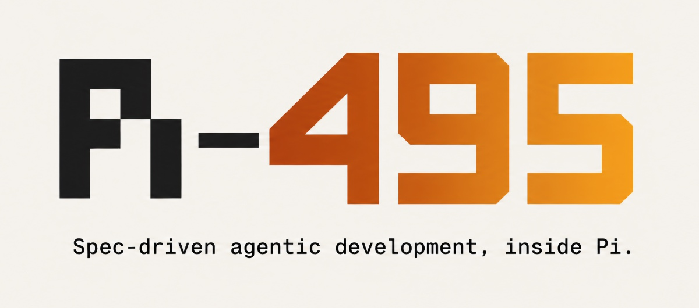
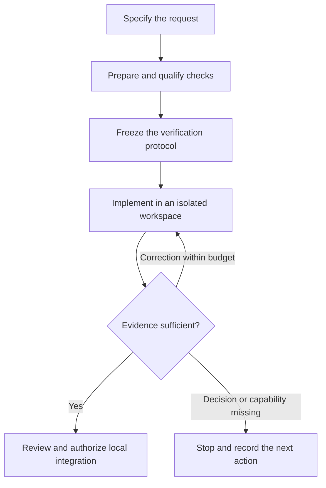

<p align="center">
  
</p>

<p align="center">
  From your request to a verified change — with evidence at every gate.
</p>

<p align="center">
  <a href="https://www.npmjs.com/package/pi-495"></a>
  <a href="LICENSE"></a>
  <a href="https://pi.dev"></a>
  <a href="#compatibility"></a>
  <a href="#compatibility"></a>
  <a href="#roadmap"></a>
</p>

<p align="center">
  <a href="#quick-start">Get started</a> ·
  <a href="#features">Features</a> ·
  <a href="#how-it-works">How it works</a> ·
  <a href="#roadmap">Roadmap</a> ·
  <a href="specs/README.md">Documentation</a>
</p>

**Pi-495 is a Pi extension that turns a software request into a change you can inspect, verify and integrate.** It coordinates the AI work, defines how success will be checked before implementation, and runs those checks on the result. You review the changes and resolve decisions that need human judgment.

Use it to add behavior, fix a bug or refactor a supported project with an explicit record of what was requested, what changed and why it was accepted.

```text
/495 start add a retry with backoff to the upload client
```

**The core rule:** the checks are frozen before implementation. The coding agent cannot change the protected tests or decide that its own work is accepted.

> **Available today:** an early implementation for macOS on Apple Silicon, with Java/Maven and Node adapters. Models come from your Pi configuration. Start with a small change on a project whose tests already run locally.


<details>
<summary><strong>Why is it called Pi-495?</strong></summary>

- **Pi** is the host. [Pi](https://pi.dev) is a minimal terminal coding harness that packages extend without forking it. It brings what 495 does not rebuild: the models you configure and authenticate, the agent session each intervention runs in, the terminal dialogues where you answer decisions, and the TUI, RPC, JSON and print modes. 495 is a Pi package, with no CLI or service of its own.
- **495** is the ***three-digit Kaprekar constant***: repeated application of a simple rule reaches a fixed point for eligible starting numbers. The name reflects the project's use of explicit rules and feedback to drive a change toward acceptance. [Explore the number](https://www.6174.co.uk/495).

</details>

## Quick start

You need **Node.js 24+**, **Pi 0.87**, **Git**, and **macOS on Apple Silicon**. Your target project must have at least one Git commit and use a supported test setup. Install its dependencies before starting: verification runs with restricted network access.

### 1. Install the extension

From npm:

```bash
pi install npm:pi-495
```

Pi installs the package and its dependencies under its own npm directory. `pi update npm:pi-495` moves it to the latest release; install `npm:pi-495@0.1.0` instead to pin a version.

From the Git repository, in a directory where you keep your tools:

```bash
git clone https://github.com/jeanjerome/pi-495.git
cd pi-495
npm ci
npm run build
pi install "$PWD"
```

Pi registers this local directory. Keep it in place; after updating the source, reinstall dependencies and rebuild it.

Install from one source only, so that a single copy of the extension loads.

### 2. Start a change in your project

```bash
cd /path/to/your-project
pi
```

Configure and authenticate your model in Pi, select it with `/model`, then enter:

```text
/495 start add a retry with backoff to the upload client
```

495 advances through specification, verification design, implementation and checks. It stops when it needs a decision or cannot proceed, and records the reason.

| Next action | Command |
| --- | --- |
| See progress and the next step | `/495 status` |
| Answer a pending decision | `/495 decide` |
| Inspect the candidate and its changes | `/495 review` |
| Read the findings and remaining risks | `/495 report` |
| Continue from the recorded state | `/495 resume` |

Integration is disabled by default. To allow it, set `policy.integration_enabled` to `true` before starting a new session. After acceptance, `/495 integrate` requests local integration and any required authorization. 495 does not push to a remote repository.

## Features

| Capability | What it gives you today |
| --- | --- |
| 📝 **Spec-driven development** | A prose request becomes explicit requirements with observable acceptance criteria and links to verification controls. |
| 🧪 **Enforced test-first workflow** | When new behavior needs tests, a separate preparation step writes them. They must run and fail on the reference before adoption; implementation cannot edit protected tests. |
| 🚦 **Evidence gates** | Controls must first demonstrate a passing case, a failing case and a tool failure. The kernel computes acceptance from recorded evidence and the configured review policy. |
| 🧩 **Context engineering** | Each intervention receives role-specific instructions, adopted artifacts, an explicit output schema and bounded feedback. Context manifests are recorded for inspection. |
| ⚖️ **Regression-aware verification** | Compare the candidate with the reference to distinguish introduced regressions from inherited findings, under a frozen tolerance policy. |
| 🧬 **Mutation testing and architecture checks** | On suitable Maven projects, assess surviving mutants on changed code, coverage of introduced lines and declared Java import boundaries. |
| 🛡️ **Sandboxed execution** | Work happens in isolated copies, with phase-specific permissions and Seatbelt confinement. An unavailable required isolation capability blocks execution. |
| 👀 **Human-in-the-loop review** | Inspect the file tree and candidate content in the terminal, open highlighted diffs, and record human decisions with their origin. |
| ⏯️ **Resumable workflows** | Pause and resume a change. Bound attempts, intervention duration and tool calls; eligible interrupted producers continue on their existing workspace. |
| 🔗 **Verifiable audit trail** | Keep artifacts, evidence and hash-chained events. Export a dossier with an offline integrity verifier that runs with Node alone. |
| 🤖 **Local and hosted models** | Use the model selected in Pi, subject to authentication and capability checks. No silent model substitution. |
| 🖥️ **Pi-native surfaces** | TUI, RPC, JSON and print expose the same underlying change state. Human actions depend on the surface's ability to supply a human origin. English and French are available. |

## How it works

**Define success → freeze the checks → produce a candidate → judge the evidence.**



Agents propose artifacts and code. The kernel runs the controls and applies the acceptance rules. Required agent reviews and human decisions are additional inputs when the protocol calls for them. `/495 verify` reruns the frozen controls without calling a model.

<details>
<summary><strong>The seven gates</strong></summary>

| Gate | What it checks |
| --- | --- |
| G0 — Mandate | The objective is explicit and material questions have answers. |
| G1 — Requirements | Requirements have observable criteria and preserve the human decisions that bind them. |
| G2 — Verification | Mandatory requirements have qualified controls or assigned human decisions; the protocol is frozen. |
| G3 — Design | The design addresses the mandatory requirements within the mandate. |
| G4 — Candidate | The candidate is complete, within scope and preserves protected paths. |
| G5 — Acceptance | The applicable evidence, required reviews and human acceptance satisfy the protocol. |
| G6 — Integration | The locally integrated tree matches the verified candidate. |

Acceptance establishes conformance to the adopted protocol, within the limits of its controls and reviews.

</details>

## Compatibility

| Area | Current scope |
| --- | --- |
| **Host** | Pi 0.87; Node.js 24 or later. 495 is a Pi package with no standalone CLI or service. |
| **Platform** | macOS on Apple Silicon. The Linux `bubblewrap` backend exists but remains unqualified and refuses productive work. Windows is not supported. |
| **Java / Maven** | Surefire tests; JaCoCo coverage and PIT mutation when the project declares the required reports; structural checks derived from supported Maven and Java declarations. Maven verification uses offline mode. |
| **Node** | `node --test` and a detected lint script. The adapter does not yet use arbitrary `package.json` test scripts: Jest, Vitest and other runners are not implied by Node support. |
| **Other languages** | Additional target adapters are required. The kernel and report contracts provide the extension boundary. |
| **Models** | Models configured and authenticated in Pi, including local OpenAI-compatible endpoints with working tool calls. Provider and subscription availability follow Pi and the provider. |

A [recorded qualification case](specs/verifications/e23-deux-fournisseurs.md) reached acceptance with one local model and one hosted model. It covers a small contract case; the record also notes that the two runs used different harness builds. It is not a qualification of every model or project shape.

<details>
<summary><strong>Execution boundaries and evidence</strong></summary>

- Selecting a model in Pi admits its provider; 495 keeps no list of destinations of its own. The model worker needs network access; tools and controls have their own confinement profiles.
- Model qualification can issue a small tool-call probe, cached per provider/model pair for the session. A hosted provider may bill that request.
- Budget controls currently cover attempts, time, continuations and tool calls; they are not a monetary spending cap.
- `export --redact` masks recognized secret patterns. Review a dossier before sharing it; pattern matching does not guarantee that every sensitive value was removed.
- The offline verifier checks dossier integrity and event-chain consistency. It does not rerun the target's checks or prove that every requirement is correct.

</details>

## Roadmap

The direction is a broader engineering workflow: understand an existing codebase, strengthen its verification, and guide changes with traceable decisions. These capabilities are planned or deferred; they are not all available in the current release.

| Direction | Planned capabilities |
| --- | --- |
| 📏 **Code quality assessment** | Adopt quality rules per technology, measure existing gaps and organize debt reduction into prioritized increments. |
| 🏗️ **Architecture assessment and migration** | Diagnose the current architecture, justify a target and plan reversible migration steps. |
| 🔍 **Brownfield verification** | Audit what existing tests assert, add characterization tests and strengthen verification as increments progress. |
| 📚 **Documentation grounding** | Retrieve version-matched sources with provenance, then validate important API uses through compilation, examples or contract tests. |
| 🧩 **Adaptive context engineering** | Assemble versioned skills, prompt templates and documentation by role, phase and model capability; observe provider-imposed instructions. |
| 🧭 **Risk-guided engineering** | Route relevant risks to rules, experiments, specialist reviews or human decisions; record consequential choices and evaluate outcomes. |
| 🛠️ **Workflow and onboarding** | Improve recovery from rejected outputs, unsupported test commands, incomplete verification and session conflicts; recalibrate budgets for hosted models. |

**Further qualification and deferred work:** Linux execution, additional advanced testing methods such as property-based testing and fuzzing, and indexed documentation retrieval with corpus maintenance. These require further work and qualification; no release date is implied.

See the [product scope](specs/product/SCOPE_LATEST.yaml), [release plan](specs/release-plan.yaml) and [execution status](specs/execution-status.yaml) for the detailed boundaries and progress.

## Reference

<details>
<summary><strong>All commands</strong></summary>

| Command | Purpose |
| --- | --- |
| `/495 start <request>` | Capture the project and drive a new change. |
| `/495 status` | Show phase, gates, attempts, evidence and next action. |
| `/495 resume` | Resume from the recorded state. |
| `/495 decide` | Present and answer pending human decisions. |
| `/495 review [path\|cand_id]` | Inspect the candidate in the TUI, or obtain a text summary on other surfaces. |
| `/495 report` | Read observations, judgments and residual risks. |
| `/495 verify` | Rerun the frozen controls on the frozen candidate. |
| `/495 integrate` | Request authorized local integration after acceptance. |
| `/495 export [--redact]` | Export the dossier and its integrity verifier. |
| `/495 pause` | Pause the current work. |
| `/495 cancel` | Cancel the change while retaining its dossier. |
| `/495 bind [change_id]` | List open changes or bind the session to one. |
| `/495 unbind` | Release the session binding. |

The conversational `harness495` tool can request status, pending decisions, review summaries, reports, verification, export and start. It cannot adopt artifacts, make human decisions or integrate a change.

</details>

<details>
<summary><strong>Configuration</strong></summary>

Configuration and state live outside your project: `$HARNESS495_DATA_DIR`, otherwise `~/.495`. Workspaces default to `~/.495/workspaces`; set `$HARNESS495_WORKSPACES_DIR` to move them.

`config.json` is optional, and so is each setting in it. The file below holds every setting at its default value. Durations are in milliseconds.

```json
{
  "policy": {
    "budgets": {
      "max_attempts": 3,
      "max_technical_retries": 2,
      "max_continuations": 3,
      "intervention_ms": 1200000,
      "increment_ms": 7200000,
      "tool_calls_per_intervention": 100,
      "feedback_bytes": 65536
    },
    "adoption": {
      "mandate": "kernel",
      "requirements": "kernel",
      "protocol": "kernel",
      "design": "kernel"
    },
    "g5_human_acceptance": false,
    "integration_enabled": false,
    "baseline": {
      "compare_to_reference": true,
      "tolerance": "no_aggravation",
      "instability": "confirm_then_indeterminate",
      "max_confirmations": 1
    },
    "stagnation_identical_candidates": 2,
    "required_reviews": []
  },
  "isolation": { "allow_unconfined": false },
  "human_origin": { "rpc_actor_env": "HARNESS495_RPC_HUMAN_ACTOR" },
  "workspace_exclusions": ["target/", "dist/", ".pi/", "__pycache__/", "build/"],
  "language": "fr"
}
```

| Setting | Purpose |
| --- | --- |
| `policy.budgets` | Attempts, retries, continuations, time and tool-call limits, feedback size. |
| `policy.adoption` | Who adopts the mandate, requirements and design: `kernel` or `human`. The protocol stays with the kernel. |
| `policy.g5_human_acceptance` | Require a human acceptance decision. |
| `policy.integration_enabled` | Permit local integration, still subject to authorization. |
| `policy.baseline` | How each control is compared with the reference. |
| `policy.stagnation_identical_candidates` | Stop after this many identical candidates in a row; `0` disables it. |
| `policy.required_reviews` | Review roles required for acceptance. |
| `isolation.allow_unconfined` | Run checks without a sandbox. Leave `false`. |
| `human_origin.rpc_actor_env` | Environment variable through which an RPC host names its human actor. |
| `workspace_exclusions` | Build outputs left out of workspaces. Keep the inputs the checks need. |
| `language` | `fr` or `en`. |

`config.json` must match its [schema](contracts/v1/harness-config.json). A file that does not, or that is not valid JSON, stops every `/495` command, and the error names the faulty settings. Fix the file, then reload Pi (`/reload`) or start a new session.

`HARNESS495_INTEGRATION=1`, `HARNESS495_HUMAN_ACCEPTANCE=1` and `HARNESS495_LANGUAGE=en` override the file. Set them before starting Pi.

</details>

## Contributing

Early feedback is especially useful on real Maven and Node projects: the request, the command used, the observed stop reason and the expected behavior help make a report actionable. Review exported content before attaching it to an [issue](https://github.com/jeanjerome/pi-495/issues).

```bash
npm ci
npm run build
npm run check
```

Read [CONVENTIONS.md](CONVENTIONS.md) and [AGENTS.md](AGENTS.md) before contributing. The [specification index](specs/README.md) links the architecture, decisions and qualification records; [contracts/v1](contracts/v1) contains the JSON schemas used at boundaries.

## License

[Apache License 2.0](LICENSE) © 2026 Jean-Jerome Levy.
