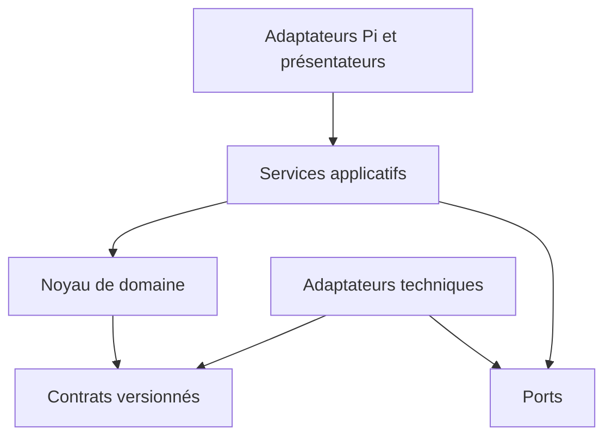
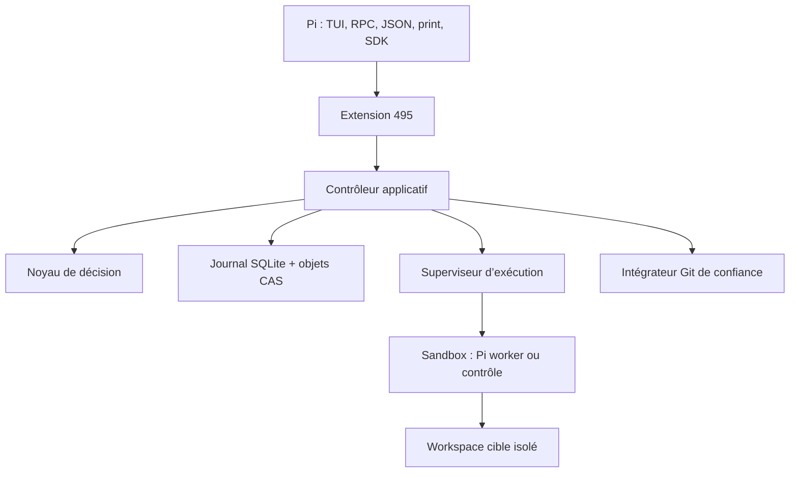
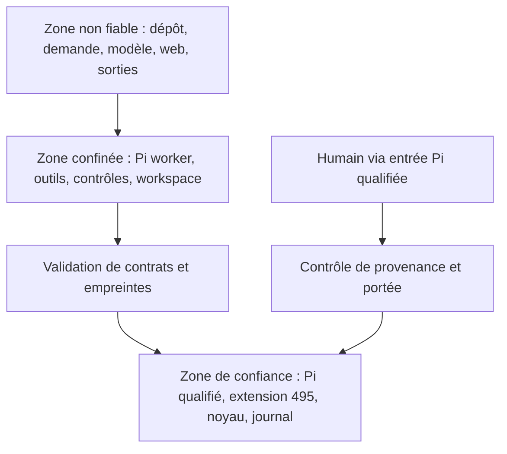

# Conception technique — 495

**Version :** 0.1 — 16 septembre 2026  
**Statut :** proposition pour validation  
**Documents amont :** *Expression de besoins — Harness de développement logiciel*, version 1.3 du 15 septembre 2026 ; *Spécification fonctionnelle — 495*, version 0.1 du 16 septembre 2026 ; *Conception de la vérification — 495*, version 0.1 du 16 septembre 2026  
**Livrable :** dossier d’architecture, contrats techniques et décisions d’architecture — ADR  
**Référence Pi étudiée :** `@earendil-works/pi-coding-agent` 0.85.1, dépôt `earendil-works/pi`, commit `aa50fe778aedb6ebeb918fc594599d12a60d8a0c`

## 1. Objet et portée

Ce document transforme les comportements et propriétés de preuve déjà adoptés en une architecture implémentable. Il définit :

- les composants et le sens de leurs dépendances ;
- les interfaces internes et les contrats échangés aux frontières ;
- les données normatives, leur persistance, leur intégrité et leur export ;
- les frontières de confiance et d’exécution ;
- l’intégration aux modes publics de Pi ;
- la stratégie de workspace, de candidat, de vérification et d’intégration Git ;
- les décisions techniques qui engagent L0 et L1.

Il ne redéfinit ni les exigences, ni les gates, ni leurs critères. Lorsqu’un choix technique ne permet pas de démontrer une propriété amont, le choix doit être révisé ; l’exigence n’est pas réduite.

### 1.1 Décision de synthèse

495 prend la forme d’un **pi-package TypeScript** chargé par Pi. L’extension Pi fournit les commandes internes, les outils conversationnels, les interactions humaines et le rendu TUI. Elle appelle un noyau métier déterministe qui reste indépendant des API Pi.

Le noyau ne confie jamais son autorité à la session de conversation. Il conserve son état dans un stockage local transactionnel composé d’un journal SQLite et d’un magasin d’objets adressés par contenu. Les sessions agentiques qui observent ou modifient le projet s’exécutent dans des **processus Pi workers confinés**, sans accès au stockage normatif. Les contrôles sont lancés par un exécuteur distinct et leurs résultats sont normalisés avant toute décision.

Le produit n’expose ni CLI `495`, ni service public, ni workflow de conduite par CI. Les processus auxiliaires, commandes de build et contrôles de la cible sont des mécanismes internes démarrés par le package.

### 1.2 Choix différés sans ambiguïté fonctionnelle

Trois paramètres restent à mesurer en L0 :

1. le backend d’isolation exact qualifié sur macOS arm64 et Linux x86-64 ;
2. le seuil de largeur qui fait basculer la revue de deux panneaux vers deux vues alternées ;
3. les limites de pagination, de cache et de taille des rendus garantissant les objectifs de réactivité.

Ces paramètres ne sont pas des portes ouvertes à une implémentation dégradée. Tant qu’un profil n’est pas qualifié, 495 annonce `capability_missing` et refuse la capacité dépendante.

## 2. Contraintes architecturales

### 2.1 Invariants techniques

| ID | Invariant d’architecture |
| --- | --- |
| `AT-01` | Seul le noyau écrit une transition, une adoption ou une décision automatique normative. |
| `AT-02` | Le domaine ne dépend ni de Pi, ni du TUI, ni de Git, ni de SQLite, ni d’un fournisseur de modèles. |
| `AT-03` | Toute donnée reçue d’un modèle, d’un outil, du dépôt ou d’une extension est non fiable jusqu’à validation. |
| `AT-04` | Une intervention productrice ne peut lire ou écrire ni politiques actives, ni protocoles gelés, ni preuves, ni décisions. |
| `AT-05` | Une preuve est recevable uniquement si ses empreintes correspondent au sujet, au protocole, au contrôle et à l’environnement courants. |
| `AT-06` | Une opération avec effet possède un identifiant d’idempotence et un état d’effet ; un effet incertain n’est jamais répété automatiquement. |
| `AT-07` | Les données canoniques précèdent leurs projections TUI, RPC, JSON, print ou SDK. |
| `AT-08` | L’état Pi et l’état 495 sont distincts : changer, compacter ou forker une session Pi ne réécrit pas un changement 495. |
| `AT-09` | L’état initial du projet est capturé avant toute écriture et reste récupérable. |
| `AT-10` | Un package ou fichier exécutable découvert dans le projet cible n’est jamais chargé dans le processus de confiance. |
| `AT-11` | Les contrats persistés et interprocessus sont validés à l’exécution ; les types TypeScript seuls ne font pas foi. |
| `AT-12` | Une limite, troncature ou perte de données produit un fait explicite et ne peut devenir implicitement `PASS`. |

### 2.2 Principes de dépendance

Le sens autorisé des dépendances est le suivant :



- Le noyau contient les valeurs, agrégats, transitions, politiques de gate, invalidations et calculs de budgets.
- Les services applicatifs coordonnent des cas d’usage mais ne calculent pas eux-mêmes les verdicts.
- Les ports décrivent les capacités attendues ; les adaptateurs Pi, stockage, Git, sandbox et exécution les implémentent.
- Les présentateurs transforment des vues canoniques en composants TUI ou en sorties structurées sans modifier leur sens.
- Aucun import depuis `domain/` vers `extension/`, `ui/`, `adapters/` ou une bibliothèque Pi n’est autorisé.

## 3. Vue d’ensemble



Le chemin interactif et le chemin automatisable se rejoignent au niveau du même `ApplicationController`. Aucun composant TUI n’est invoqué par le domaine. Aucun résultat de worker n’atteint le domaine sans validation de contrat et rattachement à des identités courantes.

## 4. Composants

### 4.1 Catalogue

| ID | Composant | Responsabilité | Niveau de confiance |
| --- | --- | --- | --- |
| `CMP-PI` | **Pi Host Adapter** | Enregistrer commandes, outil conversationnel, événements Pi, raccourcis et présentateurs ; traduire les modes Pi. | Confiance, profil qualifié |
| `CMP-APP` | **Application Controller** | Orchestrer les cas d’usage, ouvrir les unités de travail, appeler les ports et commettre les résultats. | Confiance |
| `CMP-DOM` | **Domain Kernel** | Appliquer transitions, gates, invalidations, budgets, autorité, applicabilité et combinaisons de preuves. | Confiance maximale |
| `CMP-PRG` | **Program Scheduler** | Maintenir le DAG des incréments, l’éligibilité, les jalons et les budgets hiérarchiques. | Confiance |
| `CMP-CTX` | **Context Builder** | Construire un manifeste de contexte borné à partir de révisions adoptées et de ressources autorisées. | Confiance |
| `CMP-INT` | **Intervention Supervisor** | Créer, observer, interrompre et terminer les Pi workers ; appliquer les budgets d’intervention. | Confiance |
| `CMP-SBX` | **Sandbox Runner** | Matérialiser un profil de permissions, démarrer le processus, limiter ses ressources et rapporter son état d’effet. | Confiance, backend qualifié |
| `CMP-WSP` | **Workspace Repository** | Capturer la référence, créer un workspace isolé, figer un candidat, comparer et fermer l’espace. | Confiance |
| `CMP-CAN` | **Candidate Observer** | Produire le manifeste complet et l’identité du candidat, y compris non suivis, suppressions et métadonnées. | Confiance |
| `CMP-VER` | **Verification Coordinator** | Résoudre le protocole gelé, ordonnancer les contrôles, normaliser les observations et produire les preuves. | Confiance |
| `CMP-TGT` | **Target Adapter Registry** | Découvrir les capacités d’une stack, produire les définitions de contrôles et parser les rapports natifs. | Seulement adaptateurs qualifiés |
| `CMP-REV` | **Review Query Model** | Construire l’union des arbres, portions modifiées, métadonnées, constats et pages de contenu. | Confiance, lecture seule |
| `CMP-EVD` | **Evidence Ledger** | Conserver événements, révisions, preuves, décisions, intégrité, rétention et export. | Confiance maximale |
| `CMP-HUM` | **Human Decision Adapter** | Présenter une décision, vérifier sa provenance et enregistrer une réponse liée à une révision. | Confiance selon l’entrée Pi |
| `CMP-GIT` | **Git Integrator** | Préparer, appliquer, confirmer ou réconcilier l’intégration locale du candidat accepté. | Confiance, effet borné |
| `CMP-EXP` | **Export Service** | Produire un dossier autonome, ouvert, vérifiable et éventuellement expurgé. | Confiance |

### 4.2 Noyau de domaine

Le noyau est une bibliothèque TypeScript sans I/O. Il expose des fonctions pures autour de cinq agrégats :

- `Program` : objectif global, incréments, jalons, obligations et budget cumulé ;
- `Increment` : valeur, dépendances, capacités requises et résultat local ;
- `Change` : état composé, artefacts adoptés, gates et action autorisée suivante ;
- `Attempt` : mandat, budget consommé, intervention et candidat produit ;
- `Protocol` : obligations, contrôles, règles de combinaison, qualification et révision gelée.

Une commande métier est évaluée par un réducteur explicite :

```text
decide(current_state, command, validated_facts, active_policy)
  -> accepted(events, effects_to_prepare)
  | rejected(domain_error)
```

Le réducteur ne lit ni l’heure, ni le système de fichiers, ni le modèle. Horloge, identifiants, empreintes et observations sont fournis comme faits. L’écriture des événements et la réservation des effets sont effectuées dans une transaction unique par `CMP-APP`.

### 4.3 Services applicatifs

Les cas d’usage P0 sont exposés comme des opérations internes stables :

| Opération | Effet principal |
| --- | --- |
| `program.create`, `program.resume`, `program.status` | Créer, relier ou consulter un programme. |
| `change.start`, `change.resume`, `change.cancel` | Conduire le cycle d’un changement. |
| `artifact.propose`, `artifact.adopt`, `artifact.revise` | Versionner et adopter demande, exigences, protocole ou conception. |
| `intervention.start`, `intervention.abort` | Piloter un rôle agentique borné. |
| `candidate.freeze`, `candidate.compare` | Identifier un candidat et produire sa vue de comparaison. |
| `verification.run`, `verification.resume` | Exécuter ou reprendre les contrôles sans modèle. |
| `decision.answer` | Enregistrer une décision humaine valide. |
| `gate.evaluate` | Calculer le verdict et l’action suivante. |
| `integration.prepare`, `integration.apply`, `integration.reconcile` | Intégrer uniquement le candidat accepté. |
| `evidence.export` | Construire un dossier autonome ou expurgé. |

Ces opérations ne constituent pas une API réseau publique. Elles sont appelées par les adaptateurs Pi et par les tests de contrat.

## 5. Intégration de Pi

### 5.1 Forme du package

495 est distribué comme un package Pi installé globalement ou au niveau utilisateur, jamais découvert et chargé implicitement depuis le projet cible. Le package déclare son extension dans `package.json` et verrouille ses dépendances de production.

La référence L0 épingle exactement Pi 0.85.1. Une mise à jour de Pi ou de `@earendil-works/pi-tui` change l’empreinte du profil et invalide la qualification correspondante.

Le package doit être chargé assez tôt pour participer à `project_trust`. Un projet cible reste non fiable pour le chargement de ressources dynamiques pendant une intervention 495. Les fichiers `AGENTS.md`, skills, extensions et configurations du projet peuvent être lus comme données lorsque le mandat le prévoit ; ils ne sont pas exécutés ou promus comme instructions de confiance par leur simple présence.

### 5.2 Points d’entrée dans Pi

L’extension enregistre des commandes Pi internes, et non une CLI produit :

| Commande Pi | Finalité |
| --- | --- |
| `/495 start` | Créer ou reprendre le programme associé au projet courant. |
| `/495 status` | Afficher phase, statut, gate, budgets, blocages et prochaine action. |
| `/495 resume` | Reprendre depuis le dernier point cohérent. |
| `/495 review` | Ouvrir la vue de revue du candidat ou de la révision indiquée. |
| `/495 verify` | Exécuter les contrôles gelés sur le candidat courant sans inférence. |
| `/495 decide` | Répondre à une demande humaine en attente. |
| `/495 integrate` | Demander l’intégration locale après G5. |
| `/495 export` | Produire le dossier autonome. |

Une commande d’extension Pi est traitée avant la boucle modèle. Elle donne donc un chemin déterministe aux opérations essentielles. La conversation naturelle reste possible grâce à un outil `harness495` à opérations fermées. Un appel de cet outil exprime une demande non fiable : il ne peut ni créer une approbation humaine, ni étendre une permission, ni écrire un verdict.

### 5.3 Adaptation aux modes Pi

| Mode Pi | Adaptateur 495 | Interaction humaine | Revue |
| --- | --- | --- | --- |
| TUI | Commandes, outil, statuts, entrées persistées et composants `@earendil-works/pi-tui` | Dialogues ou vue dédiée ; réponse explicite | Composant arbre/lecteur via `ctx.ui.custom()` |
| RPC | Commandes d’extension et événements structurés | Sous-protocole UI Pi seulement si le client est qualifié pour porter l’identité humaine | Requêtes paginées et objets `ReviewSnapshot`; pas de `custom()` |
| JSON | Événements et messages sérialisés | `decision_required`, jamais attente implicite | Résumé et pages structurées |
| Print | Résumé textuel borné | Identifiant reprenable, aucune approbation | Lecture textuelle agréable d’un chemin demandé |
| Hôte SDK | Extension chargée par le runtime Pi de l’hôte | Selon un `HumanOriginProvider` qualifié | Présentateur choisi par l’hôte à partir du modèle canonique |

`ctx.hasUI` n’est pas suffisant pour sélectionner le TUI : il vaut aussi vrai en RPC. Toute utilisation de composants terminal vérifie `ctx.mode === "tui"`. Les méthodes Pi non disponibles hors TUI ne sont jamais utilisées comme source de vérité.

### 5.4 Cycle de vie Pi

| Événement Pi | Traitement 495 |
| --- | --- |
| `session_start` | Résoudre la liaison `cwd`/programme, reconstruire uniquement l’état de présentation et démarrer les ressources nécessaires à la session. |
| `session_before_switch` / `session_before_fork` | Refuser une transition si une interaction bloquante ne peut être suspendue proprement ; sinon enregistrer le point de reprise. |
| `session_shutdown` | Fermer les ressources de session, demander un arrêt sûr aux opérations liées et persister tout effet incertain à réconcilier. |
| `session_before_compact` / `session_compact` | Ne jamais utiliser le résumé comme stockage normatif ; reconstruire le prochain contexte depuis le manifeste adopté. |
| `model_select` / `thinking_level_select` | Enregistrer la nouvelle configuration pour une future intervention ; ne pas modifier l’intervention en cours ni les budgets consommés. |
| `tool_call` | Bloquer les outils incompatibles avec le profil actif ; les instructions textuelles ne modifient pas la politique. |
| `agent_settled` | Constater la fin de la boucle Pi, sans en déduire la fin du changement. |

L’état 495 n’est pas stocké dans les entrées de session Pi. `pi.appendEntry()` sert à conserver un pointeur et une projection d’affichage ; le journal 495 reste l’autorité. Un fork de conversation ne clone pas un programme ou un changement. Il doit explicitement se rattacher à l’objet existant ou en créer un nouveau.

### 5.5 Vue de revue TUI

Le composant `ReviewSurface` reçoit un `ReviewSnapshot` immuable et n’accède jamais directement au workspace. Il contient :

- `ReviewHeader` : programme, incrément, base, candidat, révision et fraîcheur ;
- `ProjectTreePane` : arbre virtualisé, recherche, filtres et statuts agrégés ;
- `FileReaderPane` : modifications, contenu, métadonnées ou constats ;
- `ReviewContextPane` : constat actif, preuve et limites ;
- `ReviewKeymap` : navigation, focus, changement de mode et retour à la conversation.

En largeur normale, `ProjectTreePane` et `FileReaderPane` sont rendus côte à côte. En dessous du seuil qualifié, le même état de sélection pilote deux vues alternées ; aucune action ne disparaît. Le composant rend au plus la hauteur visible du terminal et demande les pages suivantes au modèle de requête.

Les portions modifiées sont typées `unchanged`, `old`, `new` et `intraline`, et le présentateur les dessine en gouttière — barre, numéro de ligne, signe et séparateur à gauche, code teinté à droite (`D-56`). Ce que la comparaison ajoute vit dans la gouttière : le signe et le numéro distinguent l'ancien du nouveau sans recourir à la couleur, et les caractères `+` et `-` appartenant au code restent des caractères du code, jamais supprimés ni confondus avec un habillage. Les positions internes restent disponibles pour la navigation et les constats. La vue des modifications occupe tout l'écran, le moteur de rendu ne prenant aucune largeur de son appelant.

La première implémentation utilise `ctx.ui.custom()` sans overlay expérimental. Elle calcule sa hauteur depuis `tui.terminal.rows`, restaure le focus à la fermeture et appelle `tui.requestRender()` après une mutation de navigation. L’overlay Pi reste exclu de P0 tant que son API est annoncée expérimentale.

### 5.x Ce que Pi tient déjà, et où s'y accrocher

Plusieurs invariants du corpus n'ont pas à être construits : Pi les tient, et `D-55` impose de s'y
accrocher plutôt que de les réécrire. Les règles métier restent ce qu'elles sont — ce sont des
invariants, et un invariant ne se délègue pas. Ce qui se délègue est leur mise en œuvre. Cette table
dit où, pour que la prochaine implémentation n'en réécrive aucune.

Relevé sur la version épinglée, `@earendil-works/pi-coding-agent` et ses paquets pairs : trente-huit
événements d'extension, trente et une pages de documentation, soixante-seize extensions d'exemple
sous `examples/extensions/`. 495 pose aujourd'hui quatre accroches — `session_start`,
`session_shutdown`, `session_before_fork`, `session_before_switch`.

| Invariant | Surface Pi qui le tient |
|---|---|
| `RM-026` La compaction conserve obligations, décisions et budgets | `session_before_compact`, `session_compact`, `session_compact_failed` ; `docs/compaction.md`, `custom-compaction.ts`, `trigger-compact.ts` |
| `RM-041`, `RM-042`, `RM-044` Permissions minimales, effets externes autorisés | `tool_call`, `tool_execution_start`, `user_bash` ; `permission-gate.ts`, `protected-paths.ts`, `confirm-destructive.ts` |
| `RM-045`, `RM-075` Rien du dépôt cible n'est chargé automatiquement | `project_trust`, `resources_discover` ; `docs/security.md` § Project Trust, `project-trust.ts` |
| `RM-046` Le contenu affiché est rendu inerte | `stripTerminalSequences` (`pi-tui`) |
| `RM-022` Fournisseur et modèle explicites, aucun repli silencieux | `model_select` ; `docs/providers.md`, `docs/models.md`, `custom-provider-*` |
| `RM-037`, `RM-040` Aucune absence de réponse ne vaut approbation | `ui_prompt_start`, `ui_prompt_end` ; `question.ts`, `questionnaire.ts`, `timed-confirm.ts` |
| `RM-028`, `RM-029` Délégation bornée, arrêt avec le parent | `agent_start`, `agent_end`, `agent_settled` ; `examples/extensions/subagent/` |
| `RM-021` Schéma de sortie par intervention | `structured-output.ts` |
| Surface de revue (`UX-06` à `UX-11`) | `HStack`, `VStack`, `Container`, `ScrollView`, `SelectList`, `KeybindingsManager`, `MouseRegion`, `visibleWidth`, `truncateToWidth`, `sliceByColumn`, `fuzzyFilter` (`pi-tui`) |
| `NFR-05` Isolation qualifiée par plateforme | `docs/containerization.md` (quatre motifs), `examples/extensions/sandbox/`, `gondolin/` |

Deux endroits du code sont déjà concernés, et ne sont pas des hypothèses.
`src/presentation/tui/review/measure.ts` calcule les colonnes qu'occupe une ligne stylée, ce que
`visibleWidth` rend ; et `NARROW_THRESHOLD` n'a de raison d'être que parce que la surface assemble
ses panneaux à la main au lieu de laisser un conteneur gérer la largeur. `src/adapters/sandbox/`
porte 389 lignes de backends écrits à la main, quand l'exemple livré par Pi couvre `sandbox-exec`
sur macOS et `bubblewrap` sur Linux en 321 lignes, par `@anthropic-ai/sandbox-runtime` — c'est-à-dire
les trois options que la question ouverte du bac à sable hésitait à départager.

Ce que 495 doit écrire lui-même est ce qui reste une fois cette table épuisée : le modèle de
comparaison, le noyau de décision, la persistance normative et les adaptateurs de technologies
cibles. Avant d'ajouter une ligne à cette liste, la recherche prescrite par `D-55` est conduite et
son résultat est écrit.

## 6. Frontières de confiance et sécurité

### 6.1 Zones



### 6.2 Base de confiance

La base de confiance P0 comprend exactement :

- la version qualifiée de Pi ;
- le package 495 et ses dépendances verrouillées ;
- le noyau, le stockage, les validateurs et les adaptateurs qualifiés ;
- le backend d’isolation et son profil ;
- l’administrateur local et le propriétaire des politiques.

Les extensions Pi ont les droits du processus Pi. Une extension tierce chargée dans ce processus rejoint donc la base de confiance. La recette de référence désactive toute extension non qualifiée ; 495 ne prétend pas se protéger d’un plugin hostile partageant son processus.

### 6.3 Profils d’exécution

| Profil | Projet d’origine | Workspace isolé | Stockage 495 | Réseau | Usage |
| --- | --- | --- | --- | --- | --- |
| `observe` | lecture seule | absent ou lecture seule | aucun accès | refusé | Diagnostic initial |
| `specify` | lecture seule ciblée | absent | aucun accès | refusé sauf source autorisée | Clarification, exigences, conception |
| `prepare` | lecture seule | écriture sur chemins mandatés | aucun accès | refusé par défaut | Tests, squelette ou capacité |
| `implement` | aucun accès direct ou lecture seule | écriture dans tout le périmètre autorisé | aucun accès | refusé par défaut | Production du candidat |
| `verify` | aucun accès direct | candidat figé en lecture seule, temporaire en écriture | écriture uniquement via canal de résultat | selon contrôle préenregistré | Contrôles |
| `review` | aucun accès direct | candidat figé en lecture seule | aucun accès | refusé | Revue spécialisée |
| `integrate` | écriture Git bornée | candidat figé en lecture seule | accès à la décision G5 | refusé | Intégration locale |

Le runner reçoit un mandat compilé, pas le document de politique complet. Il monte ou autorise seulement les chemins nécessaires, fournit un environnement construit à partir d’une liste blanche, ferme les descripteurs inutiles et refuse les symlinks sortant du périmètre.

### 6.4 Défense contre les contournements

1. Pendant une opération 495, la session de contrôle remplace la liste d’outils actifs par les seuls outils qualifiés et la restaure à la sortie.
2. Les Pi workers ont un `ResourceLoader` explicite : aucun skill, `AGENTS.md`, extension ou package du projet n’est chargé implicitement.
3. Le worker ne reçoit ni chemin du stockage 495, ni secret sans nécessité, ni droit sur le dépôt utilisateur original.
4. Les sorties terminal, noms de fichiers et contenus sont neutralisés lors du rendu ; les octets conservés restent intacts.
5. Les parsers de rapports considèrent toute sortie comme hostile et appliquent taille maximale, encodage et schéma.
6. L’intégrateur Git n’est jamais un outil du modèle. Il est appelé par le contrôleur après décision et autorisation.
7. Un changement concurrent dans le dépôt ou le workspace modifie l’empreinte et invalide les preuves dépendantes.

### 6.5 Limites revendiquées

495 ne résiste pas à un administrateur hostile contrôlant à la fois le processus Pi, le stockage et le backend d’isolation. Le chaînage des événements détecte des altérations accidentelles ou hors du chemin normal ; il ne constitue pas une signature externe. Un profil dont le backend ne confine pas effectivement les voies d’action ne peut annoncer SEC-02 ou SEC-03 comme satisfaites.

## 7. Persistance normative

### 7.1 Choix de stockage

Le stockage combine :

- une base **SQLite** locale pour les événements, identités, références, projections et opérations ;
- un **CAS** (*content-addressed store*) pour les artefacts, rapports, contenus de fichiers, captures et exports volumineux ;
- des formats JSON canoniques et JSONL pour les exports autonomes.

Le stockage se trouve dans le répertoire de données applicatives de l’utilisateur, hors du projet cible. Les chemins de plateforme sont résolus par un adaptateur ; ils ne sont jamais injectés dans un worker.

### 7.2 Organisation logique

```text
495-data/
  state.sqlite
  objects/
    sha256/ab/cd...                # octets immuables
  workspaces/                      # données temporaires, non normatives
  exports/                         # dossiers demandés par l’utilisateur
  locks/
```

La base comprend au minimum les tables suivantes :

| Table | Contenu |
| --- | --- |
| `events` | Journal append-only : séquence, corrélation, causalité, acteur, type, payload, empreintes précédente et courante. |
| `artifacts` | Identité stable d’un artefact. |
| `artifact_revisions` | Révisions immuables et référence CAS du contenu. |
| `programs`, `increments`, `changes`, `attempts` | Projections courantes reconstruites depuis les événements. |
| `operations` | Idempotence, statut, deadline, demande, résultat et état d’effet externe. |
| `evidence` | Métadonnées canoniques, verdict et pièces jointes CAS. |
| `gate_decisions` | Décisions du noyau et révisions exactes évaluées. |
| `human_decisions` | Identité, autorité, objet, portée, réponse et expiration. |
| `pi_bindings` | Liaison non normative entre session/cwd Pi et programme ou changement. |
| `leases` | Verrou logique par programme/changement et récupération après crash. |
| `schema_migrations` | Version, empreinte, date et résultat des migrations. |

Les projections sont remplaçables ; les événements et objets référencés ne le sont pas.

### 7.3 Écriture atomique

Une écriture normative suit cet ordre :

1. écrire l’objet dans un fichier temporaire, calculer SHA-256, synchroniser puis renommer atomiquement vers son chemin CAS ;
2. ouvrir une transaction SQLite `IMMEDIATE` ;
3. vérifier la révision attendue et le lease ;
4. insérer l’événement, ses références et la mise à jour de projection ;
5. calculer `event_hash = SHA-256(previous_hash || canonical_event)` ;
6. commettre la transaction ;
7. publier l’événement aux présentateurs.

Un crash avant l’étape 6 laisse soit l’ancien état cohérent, soit un objet CAS non référencé récupérable par nettoyage. Il ne laisse pas une décision visible sans son événement.

SQLite fonctionne avec `foreign_keys=ON`, un seul writer logique et un mode de journal qualifié par tests de panne. Le choix exact du binding Node et des pragmas est figé après L0 ; il ne change pas les contrats `EvidenceStorePort`.

### 7.4 Effets externes et reprise

Tout effet Git, processus ou dialogue bloquant suit l’état fermé :

`prepared → started → confirmed | failed | uncertain → reconciled`

La transaction `prepared` contient les entrées, le digest, l’autorisation et la clé d’idempotence avant le démarrage. Le reçu externe permet de confirmer. Si le processus disparaît entre l’effet et son reçu, l’état devient `uncertain` et impose `IH-12` ou une observation de réconciliation. Aucun mécanisme « exactly once » n’est revendiqué.

### 7.5 Export autonome

Un export complet contient :

```text
manifest.json
schemas/
program.json
increments/
changes/<change-id>/
  artifacts/
  candidates/
  evidence/
  decisions/
  integration/
events.jsonl
objects/sha256/
redactions.json                 # présent seulement si expurgation
verify-integrity.json
```

`manifest.json` référence chaque fichier par taille, type et SHA-256. L’export est lisible sans Pi et vérifiable sans fournisseur de modèle.

## 8. Contrats techniques versionnés

### 8.1 Règles communes

Les frontières interprocessus, persistées et exportées utilisent JSON Schema 2020-12. Les schémas résident sous `contracts/v1/` et possèdent un `$id` stable de forme `urn:495:contract:<name>:1`.

Les contrats sont produits depuis une source TypeBox et validés à l’exécution dans les deux sens. Chaque enveloppe contient :

```json
{
  "schema_version": 1,
  "message_id": "msg_...",
  "operation_id": "op_...",
  "correlation_id": "cor_...",
  "causation_id": "evt_...",
  "occurred_at": "2026-09-16T17:00:00.000Z",
  "producer": {
    "component": "verification-coordinator",
    "version": "0.1.0",
    "instance_id": "ins_..."
  },
  "payload": {}
}
```

Le JSON destiné aux empreintes suit une sérialisation canonique déterministe. Les dates sont UTC, les durées sont exprimées en millisecondes, les tailles en octets. `null`, champ absent et zéro conservent des sens distincts.

Une version majeure inconnue est refusée avant mutation. Une migration lit l’original, produit une nouvelle représentation, conserve la provenance et ne modifie jamais l’archive source.

### 8.2 Références communes

| Type | Champs obligatoires |
| --- | --- |
| `ArtifactRef` | `artifact_id`, `revision`, `content_digest`, `schema_version` |
| `SubjectRef` | `kind`, `id`, `revision`, `digest` |
| `CandidateRef` | `candidate_id`, `manifest_digest`, `base_digest`, `workspace_id` |
| `ProtocolRef` | `protocol_id`, `revision`, `content_digest` |
| `EnvironmentRef` | `environment_id`, `digest`, `profile_id` |
| `ActorRef` | `actor_id`, `actor_type`, `role`, `origin`, `authentication_level` |
| `ObjectRef` | `algorithm`, `digest`, `size_bytes`, `media_type` |

Une référence sans digest n’est autorisée que pour rechercher un objet ; elle ne peut participer à une décision.

### 8.3 Commande et résultat d’opération

`OperationRequest` contient : `operation_id`, `idempotency_key`, `operation_type`, `subject`, `expected_revision`, `mandate_ref`, `deadline`, `inputs` et `inputs_digest`.

`OperationResult` contient :

- `status` : `accepted`, `running`, `succeeded`, `failed`, `indeterminate` ou `cancelled` ;
- `effect_state` : `none`, `prepared`, `started`, `confirmed`, `failed`, `uncertain` ou `reconciled` ;
- `output_refs`, `event_refs`, `error` et `limits` ;
- les mêmes identifiants de corrélation et d’idempotence que la demande.

Deux demandes possédant la même clé d’idempotence et le même digest retournent la même opération. Une même clé avec un digest différent produit `IDEMPOTENCY_CONFLICT`.

### 8.4 `AgentPort`

```text
describeCapabilities(profileRef) -> AgentCapabilities
startIntervention(InterventionMandate) -> OperationAccepted
observeIntervention(operationId, cursor?) -> AgentEventPage
requestCheckpoint(operationId) -> OperationResult
abortIntervention(operationId, reason) -> OperationResult
getInterventionState(operationId) -> InterventionState
```

`InterventionMandate` référence le rôle, l’objectif, le contexte, les outils, le profil de sandbox, le provider, le modèle exact, le thinking level, les budgets, le schéma de sortie et le candidat d’entrée. Les événements appartiennent à un ensemble fermé : `started`, `model_event`, `tool_started`, `tool_finished`, `checkpointed`, `completed`, `failed`, `cancelled`.

La fin `completed` signifie uniquement que le worker a terminé. Elle ne porte aucun verdict de gate.

### 8.5 `SandboxPort`

```text
qualify(profile, platform) -> QualificationResult
prepare(ExecutionMandate) -> SandboxHandle
spawn(handle, ExecutableRequest) -> OperationAccepted
signal(operationId, signal) -> OperationResult
collect(operationId, cursor?) -> ProcessObservation
close(handle) -> OperationResult
```

`ExecutableRequest.command` est un tableau d’arguments ; aucun shell implicite n’est permis. La requête déclare `cwd`, variables autorisées, entrées montées, sorties attendues, timeout, limites de flux, profil réseau et secrets référencés. Toute capacité absente est détectée avant `spawn`.

### 8.6 `WorkspacePort` et `RepositoryPort`

```text
captureReference(ProjectLocation) -> ReferenceSnapshot
createWorkspace(ReferenceSnapshot, WorkspacePolicy) -> WorkspaceHandle
snapshotCandidate(WorkspaceHandle, CandidatePolicy) -> CandidateManifest
compare(reference, candidate, options) -> ReviewSnapshotRef
prepareIntegration(candidate, destination) -> IntegrationPlan
applyIntegration(plan, authorization) -> IntegrationReceipt
reconcileIntegration(operationId) -> IntegrationReceipt | ReconciliationRequired
closeWorkspace(workspaceId, retentionPolicy) -> OperationResult
```

`CandidateManifest` contient une liste triée de chemins avec `kind`, `content_digest`, `size`, `mode`, `symlink_target`, `baseline_state`, `origin` et `limits`. Le digest du candidat porte sur le manifeste canonique complet, jamais sur `git diff` seul.

### 8.7 `ControlExecutionPort`

```text
describeControl(controlRef) -> ControlDescriptor
runControl(ControlInvocation) -> OperationAccepted
observeControl(operationId, cursor?) -> ControlEventPage
cancelControl(operationId) -> OperationResult
normalizeResult(operationId) -> EvidenceCandidate
```

Une `ControlInvocation` référence la révision gelée du contrôle, le candidat, l’environnement, le timeout, le parser qualifié et les exigences couvertes. `EvidenceCandidate` est validé par `CMP-VER`, puis écrit par `CMP-EVD`. Un adaptateur ne peut écrire directement `Evidence` ou `GateDecision`.

### 8.8 `EvidenceStorePort`

```text
append(expectedRevision, DomainEvent[]) -> CommitReceipt
putObject(stream, mediaType) -> ObjectRef
getObject(objectRef, range?) -> BytePage
readAggregate(aggregateRef, atRevision?) -> AggregateSnapshot
verifyIntegrity(scope) -> IntegrityReport
export(scope, redactionPolicy) -> ExportRef
```

`append` est atomique et optimiste. Une concurrence produit `REVISION_CONFLICT`, jamais un écrasement. `putObject` vérifie le digest à la fin du flux et déplace l’objet de manière atomique.

### 8.9 `ApprovalPort`

```text
requestDecision(DecisionRequest) -> DecisionRequestRef
recordDecision(DecisionResponse, HumanOrigin) -> HumanDecisionRef
getPending(scope) -> DecisionRequest[]
revokeDecision(decisionRef, authority) -> OperationResult
```

`DecisionRequest` contient l’interaction `IH-*`, l’objet et sa révision, les faits, la recommandation séparée, les choix, leurs effets, l’autorité requise et l’expiration. `DecisionResponse` ne contient pas seule la provenance : `HumanOrigin` est fourni par l’adaptateur hôte qualifié.

En TUI local, l’action clavier dans un dialogue 495 actif constitue l’origine de session, sans prétendre identifier civilement la personne. En RPC ou SDK, un client ne peut produire une décision humaine que si sa configuration fournit un mécanisme d’identité qualifié. JSON et print ne produisent jamais d’approbation.

### 8.10 `ReviewQueryPort`

```text
openReview(reference, candidate, options) -> ReviewSnapshot
listPaths(snapshotId, parent, filter, page) -> PathPage
readContent(snapshotId, path, side, page) -> ContentPage
readChanges(snapshotId, path, page) -> ChangePage
listFindings(snapshotId, path?, page?) -> FindingPage
closeReview(snapshotId) -> void
```

`ReviewSnapshot` contient les références et digests comparés, l’horodatage, la fraîcheur, la complétude, les limites et le curseur de version. Une page de changements contient des segments sémantiques et des positions internes ; elle ne contient pas un texte de patch destiné à l’utilisateur.

### 8.11 Preuve et constat canoniques

`Evidence` reprend obligatoirement : `evidence_id`, `requirement_refs`, `control_id`, `control_version`, `subject`, `protocol_revision`, `environment_digest`, `inputs_digest`, `started_at`, `ended_at`, `verdict`, `facts`, `artifacts`, `limits`, `producer` et `integrity`.

`Finding` reprend : `rule_id`, `category`, `severity`, `message`, `path`, `region`, `symbol`, `requirement_refs`, `baseline_state`, `fingerprint`, `tool`, `tool_version`, `confidence` et `raw_evidence_ref`.

Les verdicts autorisés sont exactement `PASS`, `FAIL`, `INDETERMINATE`, `NOT_RUN`, `NOT_APPLICABLE`.

### 8.12 Erreur canonique

```json
{
  "code": "CAPABILITY_MISSING",
  "category": "capability",
  "summary": "Le profil verify n’est pas qualifié sur cette plateforme.",
  "subject": { "kind": "change", "id": "chg_...", "revision": 4 },
  "phase": "verification_design",
  "retryable": false,
  "effect_state": "none",
  "next_actions": ["qualify_capability", "revise_mandate"],
  "details_ref": null
}
```

Les catégories suivent la spécification fonctionnelle : `request`, `configuration`, `capability`, `provider`, `execution`, `verification`, `candidate`, `policy`, `evidence`, `git`, `storage`, `interface`. Les codes sont stables et documentés ; le message humain peut évoluer.

## 9. Workspaces, candidats et Git

### 9.1 Capture de la référence

`CMP-WSP` classe l’entrée dans l’un des cas suivants :

| Cas | Référence technique |
| --- | --- |
| Git propre avec `HEAD` | Commit `HEAD` et manifeste de l’arbre courant. |
| Git sale avec `HEAD` | Commit `HEAD` plus instantané immuable des changements suivis et non suivis retenus. |
| Git sans `HEAD` | Référence vide Git plus instantané des fichiers présents. |
| Répertoire vide autorisé | Référence vide explicite. |
| Répertoire non Git non vide | Instantané initial ; initialisation Git seulement après décision prévue. |

Le fichier `.git` ou le répertoire Git ne fait pas partie du contenu applicatif du candidat. Les sous-modules, liens, permissions, encodages et fichiers spéciaux sont inventoriés explicitement.

### 9.2 Workspace isolé

- Un projet propre peut utiliser un worktree Git isolé.
- Un projet sale, sans `HEAD` ou non Git utilise un workspace matérialisé depuis le manifeste de référence, avec un dépôt Git temporaire interne servant uniquement à l’observation.
- Le projet utilisateur original n’est jamais le workspace d’écriture d’un worker.
- Les exclusions de copie sont déclarées ; une exclusion nécessaire à l’interprétation du candidat rend la comparaison incomplète.

Cette stratégie évite de mélanger les modifications préexistantes et la tentative tout en permettant au candidat de partir réellement de l’état observé par l’utilisateur.

### 9.3 Identité du candidat

Chaque entrée du manifeste est triée par chemin normalisé et contient son type, ses octets ou sa cible, son mode et son origine observable. Le candidat est identifié par :

```text
candidate_digest = SHA-256(
  canonical(base_ref, selected_paths, exclusions, entries, metadata_policy)
)
```

Une heuristique de renommage ne modifie pas cette identité. Elle appartient à la vue de comparaison avec un niveau de confiance ; sous le seuil qualifié, le changement reste une suppression et un ajout.

### 9.4 Intégration

L’intégration est effectuée par `CMP-GIT`, jamais par le worker. Elle suit :

1. vérifier que la décision G5 référence exactement le digest du candidat ;
2. observer la destination et comparer sa référence à celle du plan ;
3. si la destination a avancé, construire la combinaison dans un workspace isolé et repasser les contrôles requis ;
4. préparer l’effet et enregistrer l’autorisation ;
5. appliquer les changements sans push, publication ni déploiement ;
6. recalculer l’arbre obtenu et le comparer au résultat attendu ;
7. écrire le reçu avant/après et confirmer G6.

Une panne entre 5 et 7 produit un effet `uncertain` et déclenche la réconciliation. Aucune commande destructive de nettoyage n’est automatique.

## 10. Interventions, contexte et modèles

### 10.1 Processus Pi worker

Chaque intervention agentique s’exécute dans un processus enfant distinct. Ce processus utilise le SDK public Pi pour créer une session avec :

- modèle et thinking level exacts ;
- `SessionManager` isolé ou en mémoire selon le besoin de checkpoint ;
- liste d’outils explicite ;
- `ResourceLoader` sans découverte ambiante ;
- contexte fourni par `ContextManifest` ;
- signal d’annulation relié au superviseur ;
- extension worker minimale de collecte d’événements et de budget.

Le worker ne contient pas le noyau de décision. Son résultat final est validé contre le schéma de sortie du mandat. Une sortie invalide devient `execution_error` ou `INDETERMINATE` selon le contrôle concerné.

Le recours au SDK dans un processus enfant combine la maîtrise programmatique des outils avec une frontière de processus. Lancer `pi --mode rpc` reste une implémentation de repli interne qualifiable, pas une interface utilisateur de 495.

### 10.2 Manifeste de contexte

`ContextManifest` contient :

- rôle, objectif et schéma de sortie ;
- instructions de confiance ordonnées ;
- références adoptées et digests ;
- extraits du projet étiquetés non fiables ;
- documentation externe, provenance, version et question ;
- outils et permissions ;
- exclusions et données volontairement absentes ;
- budget d’entrée, réserve de sortie et troncatures ;
- stratégie de reconstruction après compaction.

Le texte complet du contexte est un artefact dérivé. Le manifeste permet de le reconstruire et d’en démontrer les entrées. Les obligations, décisions, budgets et exclusions ne dépendent jamais d’un résumé de conversation.

### 10.3 Modèles

Le domaine manipule un `ModelSelection` contenant `provider_id`, `model_id`, paramètres natifs autorisés, `thinking_level` et empreinte de configuration. Il n’invente ni équivalence de modèles, ni repli implicite.

Le modèle local `omlx/qwen3.8-27b-oq8e` peut être un profil qualifié Pi au même titre qu’un fournisseur distant. Son succès annoncé ne devient jamais une preuve de conformité ; seuls les contrôles exécutés alimentent les gates. La sélection et les credentials restent gérés par Pi. 495 n’extrait ni ne réutilise des secrets d’authentification hors des mécanismes prévus par Pi.

### 10.4 Budgets

Les compteurs sont tenus par le noyau et alimentés par les événements du worker : durée, appels d’outils, octets de contexte, tokens connus, délégations et tentatives. Un événement manquant ou incohérent ne donne pas de budget gratuit. Le superviseur applique en plus des limites techniques ; la limite normative reste celle du noyau.

## 11. Contrôles et adaptateurs de technologies cibles

### 11.1 Contrat commun

Un adaptateur cible qualifié fournit :

- des détecteurs de stack sans exécution implicite ;
- des capacités déclarées avec versions et permissions ;
- des propositions de `ControlDefinition` ;
- des parsers de rapports natifs ;
- des transformations vers `Evidence` et `Finding` canoniques ;
- des fixtures positives, négatives et d’incident ;
- une procédure de nettoyage.

Le premier adaptateur est générique : il exécute une commande sous forme de tableau, dans un cwd et un environnement bornés, puis interprète code de sortie, flux et rapports selon un parser explicitement choisi. Aucun langage n’est imposé à la cible.

### 11.2 Analyse multi-langages

495 n’impose pas un analyseur universel et ne laisse pas le noyau comprendre les formats propres à chaque outil. Les outils natifs peuvent différer par langage, mais tous leurs constats passent par le même `Finding`.

La notion de règle commune appartient à un profil qualifié :

```text
native rule + native version + parser version
  -> canonical rule_id + category + semantics_revision
```

Deux règles de même nom ne sont jamais déclarées équivalentes sans cette correspondance. Les techniques de Fallow — graphe de dépendances, règles déclaratives, localisations et rapport structuré — sont transposables comme modèle de données et d’exécution, pas comme hypothèse qu’un même analyseur sait interpréter tous les langages.

### 11.3 Qualification

Avant de contribuer à G2 ou G5, chaque contrôle démontre :

1. un témoin positif donnant `PASS` ;
2. un contre-exemple ciblé donnant `FAIL` ;
3. un runner ou parser cassé donnant `INDETERMINATE` ;
4. la stabilité ou la politique d’aléa ;
5. l’impossibilité pour le producteur de modifier sa définition gelée.

Les rapports natifs sont conservés en CAS, mais seule la preuve canonique validée est consommée par le noyau.

## 12. Fiabilité, concurrence et performance

### 12.1 Concurrence

P0 autorise un seul producteur par changement et un writer normatif par programme. Un lease possède propriétaire, expiration, heartbeat et opération courante. Un lease expiré ne permet pas de reprendre un effet externe sans réconciliation.

Les lectures de revue, d’état et de preuves sont concurrentes et portent sur une révision explicite. Une actualisation crée un nouveau snapshot ; elle ne modifie pas celui lié à une décision.

### 12.2 Flux et volumes

- Les stdout/stderr, objets et contenus de fichiers sont traités en flux.
- Les pages utilisent des curseurs opaques liés au digest du snapshot.
- Une page demandée sur un snapshot différent est refusée par `STALE_CURSOR`.
- Les limites de taille produisent `truncated=true`, le nombre d’octets lus et un objet contenant la sortie complète si la politique de rétention l’autorise.
- Le TUI ne charge pas tout un grand arbre ni tout un fichier avant d’être interactif.

### 12.3 Annulation

Le signal utilisateur atteint successivement `CMP-PI`, `CMP-APP`, `CMP-INT` ou `CMP-VER`, puis `CMP-SBX`. Après le délai de grâce qualifié, le runner termine le groupe de processus. Le noyau enregistre ce qui a été observé et distingue `cancelled`, `failed` et `uncertain`.

### 12.4 Observabilité

Les logs techniques sont locaux, structurés et corrélés par `operation_id`. Ils ne sont pas normatifs. Les événements normatifs contiennent les faits nécessaires sans dépendre de logs éphémères. Aucune télémétrie distante n’est activée par défaut.

## 13. Organisation du code et distribution

### 13.1 Structure proposée

```text
src/
  extension/                    # factory Pi, commandes, outil, événements
  presentation/
    tui/                        # composants de revue et dialogues
    structured/                 # RPC, JSON, print, SDK
  application/                  # cas d’usage et unités de travail
  domain/                       # agrégats, policies, reducers, invariants
  contracts/                    # TypeBox + JSON Schema v1
  ports/                        # interfaces hexagonales
  adapters/
    pi-worker/
    sandbox/
    storage-sqlite/
    object-store/
    workspace/
    git/
    execution/
    target/
  export/
test/
  fixtures/
  contracts/
  properties/
  integration/
  e2e-pi/
contracts/v1/                   # schémas JSON publiés
```

Le package reste un déployable unique. Des binaires ou ressources propres à une plateforme peuvent être livrés comme dépendances optionnelles internes, sélectionnées par le package ; l’utilisateur n’a pas à installer manuellement une collection d’outils du harness.

### 13.2 Règles de construction

- TypeScript strict et ESM ; runtime minimal aligné sur la version Node qualifiée avec Pi.
- Dépendances exactes et inventaire SBOM/licences.
- Contrôle automatique des imports entre couches.
- Pas de dépendance runtime Python pour L1 ; les comportements utiles de l’implémentation Python antérieure sont repris par tests de caractérisation et migration incrémentale.
- Les outils propres à une cible restent dans le projet cible ou dans un adaptateur qualifié ; ils ne contaminent pas le noyau.
- Les tests V0 à V3 fonctionnent hors ligne et avec fournisseurs simulés.

## 14. Correspondance architecture → contrôles de qualification

| Composants | Contrôles dominants | Propriétés principales |
| --- | --- | --- |
| `CMP-DOM`, `CMP-APP`, `CMP-PRG` | `C-FSM`, `C-REQ`, `C-PRG` | Transitions, invalidations, DAG, budgets et déterminisme. |
| `CMP-CTX`, `CMP-INT` | `C-CTX`, `C-AGT` | Contextes reconstruisibles, modèles explicites, annulation et sorties. |
| `CMP-SBX` | `C-SEC`, `C-PKG` | Moindre privilège, voies d’action, plateformes et absence de dépendance implicite. |
| `CMP-WSP`, `CMP-CAN`, `CMP-GIT` | `C-CAN`, `C-GIT` | Dépôt sale, candidat intégral, destination avancée, panne et réconciliation. |
| `CMP-VER`, `CMP-TGT` | `C-PRO`, `C-EXE`, `C-EXT` | Qualification des capteurs, exécution commune et stacks distinctes. |
| `CMP-REV` et présentateurs | `C-UIR`, `C-PI` | Union des chemins, rendu fidèle, clavier, modes étroits et cohérence multicanale. |
| `CMP-EVD`, `CMP-EXP` | `C-EVD` | Transaction, corruption, chaînage, rétention et lecture hors ligne. |
| `CMP-HUM` | `C-HUM`, `C-PI` | Provenance, portée, refus et décision persistante. |
| Package complet | `C-PKG`, V3 à V5 | Installation Pi, licences, macOS/Linux, sécurité, UX et performance. |

## 15. Décisions d’architecture — ADR

### ADR-001 — Pi est l’unique surface produit

**Statut :** acceptée.  
**Décision :** distribuer 495 comme pi-package ; utiliser commandes, outil conversationnel et présentateurs Pi ; ne fournir ni CLI 495, ni service public, ni job CI de conduite.  
**Conséquence :** les commandes de build restent internes ; chaque mode Pi est qualifié séparément.

### ADR-002 — Package et noyau de référence en TypeScript

**Statut :** acceptée pour L0/L1.  
**Décision :** implémenter extension, services et noyau en TypeScript, sans dépendance runtime Python.  
**Motif :** installation unique avec Pi, contrats partagés et accès direct aux API publiques Pi.  
**Conséquence :** le code Python existant sert de référence de comportement et de source de tests ; sa reprise est incrémentale, pas une traduction aveugle.

### ADR-003 — Noyau hexagonal et déterministe

**Statut :** acceptée.  
**Décision :** fonctions pures et ports ; aucune API Pi ou I/O dans le domaine. Pas de bibliothèque de machine à états en P0 : transitions explicites, tables et tests de propriétés.  
**Conséquence :** les gates sont testables sans modèle ni Pi ; toute commodité d’adaptateur reste extérieure.

### ADR-004 — Contrôleur de confiance et Pi workers confinés

**Statut :** acceptée, sous qualification du backend.  
**Décision :** garder l’extension et le noyau dans la zone de contrôle ; exécuter chaque intervention dans un processus enfant Pi SDK confiné, sans accès au stockage normatif.  
**Conséquence :** un import in-process ou une simple consigne de lecture seule ne constitue pas une isolation.

### ADR-005 — Stockage SQLite, CAS et journal append-only

**Statut :** acceptée.  
**Décision :** utiliser SQLite pour transactions et projections, un CAS SHA-256 pour les octets, et une chaîne d’empreintes pour les événements.  
**Alternative rejetée :** fichiers JSON mutables seuls, insuffisants pour concurrence, reprise et atomicité.  
**Limite :** pas de protection contre l’administrateur local hostile.

### ADR-006 — JSON Schema 2020-12 aux frontières

**Statut :** acceptée.  
**Décision :** schémas versionnés générés depuis TypeBox, validation runtime entrante et sortante, version majeure inconnue refusée avant effet.  
**Conséquence :** les structures internes TypeScript peuvent évoluer sans devenir un contrat implicite.

### ADR-007 — Protocole interprocessus JSONL corrélé

**Statut :** acceptée.  
**Décision :** enveloppes JSONL sur stdio entre superviseur et workers, messages bornés, corrélation, idempotence, heartbeat et arrêt explicite.  
**Alternative rejetée :** serveur HTTP local permanent, qui agrandit inutilement la surface et le cycle de vie.

### ADR-008 — SDK Pi dans les workers

**Statut :** acceptée pour prototype.  
**Décision :** créer les sessions workers avec le SDK Pi dans le processus confiné ; garder le mode RPC Pi comme repli interne à qualifier.  
**Motif :** outils, modèle, ressources et session sont configurables de manière typée sans exposer une nouvelle interface utilisateur.

### ADR-009 — Commandes Pi déterministes et outil conversationnel limité

**Statut :** acceptée.  
**Décision :** toutes les opérations critiques disposent d’une commande Pi ; l’outil `harness495` facilite la conversation mais ne porte aucune autorité humaine ou normative.  
**Conséquence :** vérifier, reprendre ou décider ne dépend pas d’une interprétation probabiliste.

### ADR-010 — Modèle de revue indépendant du rendu

**Statut :** acceptée.  
**Décision :** produire un `ReviewSnapshot` paginé commun ; rendre un composant deux panneaux en TUI et des projections structurées ailleurs.  
**Conséquence :** `ctx.ui.custom()` est utilisé uniquement en TUI ; l’overlay expérimental est exclu de P0.

### ADR-011 — Workspace isolé et manifeste complet du candidat

**Statut :** acceptée.  
**Décision :** ne jamais laisser le worker écrire dans le dépôt original ; construire le candidat depuis un workspace et l’identifier par un manifeste de contenu complet.  
**Conséquence :** un `git diff` ou un nom de branche ne suffit pas ; les dépôts sales et sans `HEAD` restent supportés.

### ADR-012 — Adaptateurs natifs, constat commun

**Statut :** acceptée.  
**Décision :** commencer par un runner de commandes générique, ajouter des adaptateurs qualifiés par stack et normaliser tous les constats.  
**Alternative rejetée :** imposer un analyseur homogène fictif à des sémantiques de langages différentes.  
**Conséquence :** l’homogénéité porte sur le protocole, les identités et les preuves.

### ADR-013 — Profils de sandbox explicites et fail closed

**Statut :** acceptée ; backend à sélectionner en L0.  
**Décision :** exprimer les permissions indépendamment de la plateforme, qualifier un backend macOS arm64 et Linux x86-64, refuser l’opération lorsqu’une restriction requise ne peut être appliquée.  
**Conséquence :** aucun fallback silencieux vers un processus non confiné.

### ADR-014 — Provenance humaine fournie par l’hôte

**Statut :** acceptée.  
**Décision :** dissocier le contenu d’une réponse de sa provenance ; autoriser TUI local et hôtes RPC/SDK qualifiés, jamais JSON/print ou appel de modèle seul.  
**Conséquence :** une approbation forgée dans un message ou un tool call est rejetée.

### ADR-015 — Intégration Git en deux temps et réconciliable

**Statut :** acceptée.  
**Décision :** préparer et enregistrer l’effet, appliquer le candidat exact, observer la destination puis confirmer G6.  
**Conséquence :** destination avancée ou panne après effet entraîne revalidation ou réconciliation ; aucun push implicite.

### ADR-016 — Profil Pi fermé pour la qualification

**Statut :** acceptée.  
**Décision :** qualifier Pi + 495 sans package communautaire optionnel ; ajouter chaque extension après admission et tester le profil composé.  
**Motif :** les extensions Pi partagent les permissions du processus et peuvent remplacer outils ou rendu.

### ADR-017 — Installation locale reproductible

**Statut :** acceptée.  
**Décision :** verrouiller versions, fournir dépendances et aides de plateforme dans le package, publier SBOM et notices, ne demander aucun service de contrôle distant.  
**Conséquence :** un moteur local Pi est un profil de première classe ; les téléchargements d’installation sont distincts du fonctionnement local.

### ADR-018 — Les sessions Pi ne sont pas le journal 495

**Statut :** acceptée.  
**Décision :** utiliser les sessions Pi pour conversation et UX, mais persister l’état normatif dans `CMP-EVD`.  
**Motif :** compaction, fork, resume et arborescence Pi ont une sémantique différente du workflow 495.  
**Conséquence :** toute liaison session-programme est réversible et reconstruisible.

## 16. Risques et points de qualification L0

| Risque | Décision de traitement | Preuve requise |
| --- | --- | --- |
| API Pi modifiée en version 0.x | Version exacte épinglée, adaptateur unique, tests de contrat | `C-PI`, V1/V3 sur chaque mode |
| `ctx.ui.custom()` insuffisant pour la revue | Prototype hauteur réelle, resize, focus, retour conversation ; modèle indépendant conservé | `F-REVIEW`, `F-LARGE`, snapshots et revue clavier |
| Extension tierce avec droits complets | Profil fermé et inventaire de provenance des outils/extensions | `C-SEC`, `C-EXT`, `F-EXTENSIONS` |
| Sandbox macOS ou Linux incomplète | Matrice d’attaque ; fail closed par capacité | `C-SEC`, V4/V5 |
| SQLite ou CAS corrompu | Transactions, chaîne, sauvegarde avant migration et tests de panne | `C-EVD`, `F-EVIDENCE` |
| Dépôt sale mal restitué | Snapshot complet, workspace matérialisé et intégration comparée | `C-CAN`, `C-GIT`, `F-NOHEAD` |
| Sortie ou rapport volumineux | Streaming, CAS, pages et limites visibles | `C-PERF`, `F-LARGE` |
| Décision RPC attribuée à tort à un humain | `HumanOriginProvider` obligatoire | `C-HUM`, `SA-030`, `SA-031` |
| Compaction Pi perdant une obligation | Contexte reconstruit depuis le manifeste normatif | `C-CTX`, `SA-019` |
| Ancien code Python divergeant | Tests de caractérisation avant reprise ; aucune compatibilité supposée | V0–V2 et matrice de migration |

L0 ne se termine pas par une démonstration visuelle. Il produit une décision argumentée pour chaque ligne, les versions réellement testées et les limites qui empêchent encore une revendication P0.

## 17. Traçabilité technique

| Exigences | Composants / contrats | ADR principales |
| --- | --- | --- |
| `BES-*`, `REQ-*` | `CMP-APP`, `CMP-DOM`, artefacts, `ProtocolRef` | ADR-003, ADR-005, ADR-006 |
| `CTX-*`, `AGT-*` | `CMP-CTX`, `CMP-INT`, `AgentPort`, `ContextManifest` | ADR-004, ADR-008, ADR-018 |
| `VER-*`, `DEC-*` | `CMP-VER`, `CMP-DOM`, `Evidence`, `OperationResult` | ADR-003, ADR-006, ADR-012 |
| `SEC-*` | `CMP-SBX`, profils, admission des extensions | ADR-004, ADR-013, ADR-016 |
| `GIT-*` | `CMP-WSP`, `CMP-CAN`, `CMP-GIT`, `CandidateManifest` | ADR-011, ADR-015 |
| `EVD-*` | `CMP-EVD`, `CMP-EXP`, `EvidenceStorePort` | ADR-005, ADR-018 |
| `UX-01` à `UX-05` | `CMP-PI`, commandes, présentateurs, bindings | ADR-001, ADR-009, ADR-014 |
| `UX-06` à `UX-11` | `CMP-REV`, `ReviewQueryPort`, `ReviewSurface` | ADR-010 |
| `EXT-*`, `PRE-*` | `CMP-TGT`, `ControlExecutionPort`, registre qualifié | ADR-012, ADR-016, ADR-017 |
| `PRG-*` | `CMP-PRG`, programme, jalon et DAG | ADR-003, ADR-005 |
| `NFR-01` à `NFR-08` | Package complet, stockage, contrats et qualification | ADR-005 à ADR-007, ADR-013, ADR-017 |

## 18. Ordre d’implémentation recommandé

### IT-0 — Contrats et noyau hors Pi

- créer `contracts/v1` et les exemples valides/invalides ;
- implémenter états, transitions, gates, invalidations, budgets et tests de propriétés ;
- fournir stockage SQLite/CAS avec pannes injectées ;
- utiliser horloge, identifiants, ports et fournisseurs simulés.

**Sortie :** V0 complet et premiers V1, sans modèle ni API Pi.

### IT-1 — Package Pi et opérations déterministes

- charger le package sur Pi épinglé ;
- implémenter `/495 start`, `status`, `resume`, `verify`, `export` ;
- vérifier TUI, RPC, JSON, print et hôte SDK ;
- lier et délier proprement les sessions sans y stocker l’autorité.

**Sortie :** même état et même verdict dans les cinq entrées.

### IT-2 — Worker, sandbox et candidat

- superviser un Pi SDK worker simulé puis réel ;
- construire les profils `observe`, `implement` et `verify` ;
- capturer dépôts propres, sales, sans `HEAD` et vides ;
- figer et comparer le candidat complet.

**Sortie :** frontière d’exécution et préservation Git qualifiées sur les deux plateformes.

### IT-3 — Vérification et décision

- runner générique, parsers, preuves et qualification des contrôles ;
- G2 à G5 sans modèle ;
- feedback borné et seconde tentative ;
- décisions humaines persistantes et provenance.

**Sortie :** changement complet accepté, refusé et indéterminé avec dossier autonome.

### IT-4 — Revue et intégration

- modèle de comparaison et pages ;
- composant TUI deux panneaux et adaptations non TUI ;
- intégration locale G6, destination avancée et réconciliation.

**Sortie :** parcours L0 complet et base du parcours L1.

### IT-5 — Programmes et préparation

- DAG, jalons, contrôles préparatoires et dépôt vierge ;
- adaptateurs TypeScript/Java puis autres stacks ;
- architecture, qualité et documentation versionnées.

**Sortie :** capacité L1 complète, seulement après exécution de V0 à V5.

## 19. Critères de complétude de la conception technique

Cette conception est prête à être transformée en backlog d’implémentation lorsque :

1. les ADR-001 à ADR-018 sont acceptées, amendées ou explicitement rejetées ;
2. les frontières de confiance et le profil Pi fermé sont acceptés ;
3. les contrats de ports et l’enveloppe commune sont assez précis pour produire leurs JSON Schemas ;
4. le choix SQLite + CAS et sa stratégie de panne sont acceptés ;
5. la séparation session Pi / état 495 est acceptée ;
6. la stratégie de workspace couvre les cinq situations d’entrée ;
7. la vue de revue peut être prototypée sans dépendre du domaine ;
8. les trois paramètres différés de L0 possèdent protocole, fixture et critère de décision ;
9. chaque composant est relié à au moins un contrôle de qualification ;
10. aucun composant agentique ne possède une voie d’écriture normative ou d’intégration.

## 20. Références techniques Pi

- [Pi — présentation, modes et extensibilité](https://pi.dev/)
- [Extensions Pi](https://github.com/earendil-works/pi/blob/aa50fe778aedb6ebeb918fc594599d12a60d8a0c/packages/coding-agent/docs/extensions.md)
- [SDK Pi](https://github.com/earendil-works/pi/blob/aa50fe778aedb6ebeb918fc594599d12a60d8a0c/packages/coding-agent/docs/sdk.md)
- [Mode RPC Pi](https://github.com/earendil-works/pi/blob/aa50fe778aedb6ebeb918fc594599d12a60d8a0c/packages/coding-agent/docs/rpc.md)
- [Composants TUI Pi](https://github.com/earendil-works/pi/blob/aa50fe778aedb6ebeb918fc594599d12a60d8a0c/packages/coding-agent/docs/tui.md)
- [Packages Pi](https://github.com/earendil-works/pi/blob/aa50fe778aedb6ebeb918fc594599d12a60d8a0c/packages/coding-agent/docs/packages.md)
- [Format des sessions Pi](https://github.com/earendil-works/pi/blob/aa50fe778aedb6ebeb918fc594599d12a60d8a0c/packages/coding-agent/docs/session-format.md)

Ces références sont épinglées au commit étudié. Une version ultérieure doit repasser les contrats `C-PI`, `C-UIR`, `C-CTX` et `C-SEC` affectés avant d’être incluse dans un profil qualifié.
