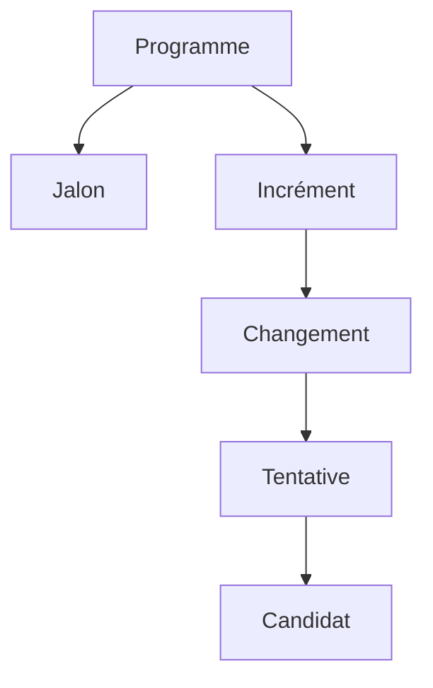
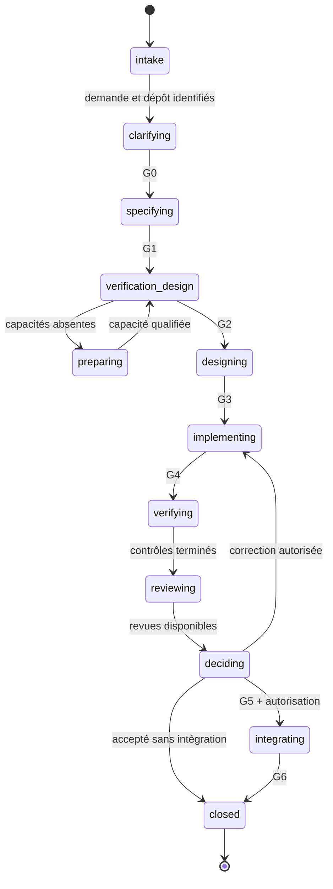

# Spécification fonctionnelle — 495

**Version :** 0.1 — 16 septembre 2026  
**Statut :** proposition pour validation  
**Document amont :** *Expression de besoins — Harness de développement logiciel*, version 1.3 du 15 septembre 2026  
**Périmètre :** comportement observable du produit, indépendamment de son architecture technique

## 1. Objet du document

Cette spécification décrit le fonctionnement attendu de 495 du point de vue de ses utilisateurs et des systèmes qui l'entourent. Elle transforme l'expression de besoins en comportements précis : parcours, règles métier, états, transitions, erreurs, interactions humaines et scénarios d'acceptation.

Elle sert de référence pour la conception technique, la conception des interfaces, la définition des contrats de données et la recette. Elle ne prescrit ni la structure interne du code, ni une bibliothèque de machine à états, ni un format de stockage.

Le produit est utilisé exclusivement depuis Pi : TUI de référence et autres entrées publiques qualifiées de Pi. Il ne fournit ni CLI autonome `495`, ni workflow de conduite du changement par CI, ni application interactive séparée. Les commandes de build, de test et d'analyse du projet cible restent exécutables en interne.

## 2. Portée fonctionnelle

### 2.1 Résultat attendu

Pour toute demande prise en charge, 495 produit l'un des résultats suivants :

1. un changement accepté, éventuellement intégré, accompagné d'un dossier de preuves ;
2. un changement arrêté ou bloqué, avec un motif explicite, les éléments déjà produits et une action de reprise possible ;
3. une décision humaine en attente, attachée à l'objet et à la révision concernés ;
4. pour une exécution limitée à la préparation ou à la spécification, un artefact adopté sans prétendre que l'application est conforme.

### 2.2 Situations d'entrée supportées

| Situation initiale | Référence fonctionnelle | Comportement attendu |
| --- | --- | --- |
| Répertoire vide autorisé | Référence vide explicite | Initialiser le dépôt et construire un socle reproductible avant les incréments métier. |
| Dépôt Git sans `HEAD` | Instantané initial explicite | Préserver les fichiers présents, qualifier le socle puis créer la première intégration. |
| Projet existant suffisamment contrôlé | Commit ou instantané adopté | Qualifier les contrôles, mesurer la référence et conduire l'évolution. |
| Projet existant sans contrôles suffisants | Commit ou instantané adopté | Préparer et qualifier les moyens de vérification avant les modifications à risque. |
| Projet existant hors standards | Baseline et référentiel cible | Organiser une trajectoire de remise à niveau sans régression métier. |
| Application partiellement générée | Dernier instantané cohérent | Diagnostiquer ce qui existe, son origine et sa validité avant de poursuivre. |
| Besoin applicatif complet | Programme parent | Décomposer en incréments et jalons, puis vérifier séparément les résultats locaux et globaux. |

Ces situations peuvent se cumuler.

### 2.3 Hors périmètre

495 ne réalise pas implicitement de déploiement en production, ne garantit ni convergence des agents ni absence de défaut, ne transforme pas une revue de modèle en preuve mécanique et ne fournit pas un éditeur de code complet. La vue de revue permet de consulter les changements ; elle ne réalise ni édition, ni staging, ni validation implicite.

## 3. Conventions fonctionnelles

### 3.1 Termes normatifs

- **DOIT** : comportement obligatoire dans la livraison concernée.
- **DEVRAIT** : comportement recommandé ; tout écart est motivé.
- **PEUT** : comportement optionnel, annoncé comme tel.
- **Révision** : version immuable d'un artefact métier.
- **Adoption** : décision du noyau, conforme à une politique préétablie, qui rend une révision normative.
- **Candidat** : instantané complet des modifications proposées, identifié indépendamment de la branche ou de la session Pi.
- **Décision** : verdict normatif calculé par le noyau ou réponse humaine enregistrée ; une sortie d'agent n'est jamais une décision.

### 3.2 Principes invariants

Les comportements suivants s'appliquent à tous les parcours :

1. un agent ne peut ni s'accepter lui-même, ni écrire un état normatif de gate ;
2. une preuve manquante, illisible, périmée ou portant sur un autre objet ne vaut pas succès ;
3. toute écriture normative crée une révision ou un événement, sans réécriture silencieuse de l'historique ;
4. toute opération avec effet est bornée, annulable lorsque son exécuteur le permet et idempotente ou réconciliable ;
5. une absence de capacité est annoncée avant l'étape qui en dépend ;
6. les mêmes faits produisent le même verdict quelle que soit l'entrée Pi utilisée ;
7. le travail préexistant de l'utilisateur est conservé et distingué du candidat autant que les observations le permettent ;
8. le changement de modèle, de session ou d'interface ne remet pas les compteurs à zéro ;
9. aucune navigation, fermeture de vue ou lecture de fichier ne constitue une approbation ;
10. une action externe n'est jamais déduite d'une intention vague.

## 4. Acteurs et autorité

| Acteur | Actions fonctionnelles | Autorité maximale |
| --- | --- | --- |
| Demandeur | Saisir le besoin, répondre aux questions, demander une révision. | Définir la valeur et le sens métier. |
| Responsable du changement | Adopter le périmètre, arbitrer, autoriser une intégration. | Décider dans le mandat du changement. |
| Responsable du programme | Ordonner les incréments, réviser la trajectoire et statuer aux jalons. | Décider dans le mandat du programme. |
| Mainteneur du projet | Définir règles, contrôles et contraintes de la cible. | Adopter les politiques de projet. |
| Référent de discipline | Examiner sécurité, données, architecture, exploitation ou autre domaine. | Avis ou approbation limitée à sa discipline. |
| Agent producteur | Proposer des artefacts et modifier l'espace autorisé. | Aucune acceptation ni extension de permissions. |
| Agent de revue | Produire des constats dans un contexte dédié. | Avis consultatif ou requis, sans écriture du candidat. |
| Noyau de décision | Appliquer politiques, gates, invalidations et transitions. | Seule autorité automatique normative. |
| Exécuteur de contrôles | Exécuter les vérifications et enregistrer les observations. | Attester une exécution, pas redéfinir son sens. |
| Intégrateur | Appliquer le candidat accepté à une destination autorisée. | Effet Git prévu par le mandat, sans déploiement. |

Une personne peut cumuler plusieurs rôles, mais chaque action conserve le rôle exercé. Le cumul humain ne fusionne pas les permissions techniques des agents.

## 5. Objets fonctionnels et identités

### 5.1 Hiérarchie



- Un **programme** porte un objectif applicatif global, un graphe d'incréments, des jalons et des budgets cumulés.
- Un **incrément** livre un résultat fonctionnel, préparatoire ou de remise à niveau, vérifiable indépendamment.
- Un **changement** est l'unité conduite par les gates.
- Une **tentative** est une production bornée d'un candidat ; une relance technique de la même opération n'est pas une tentative.
- Un **candidat** est l'objet exact observé, revu et vérifié.

### 5.2 Révision et immutabilité

Tout artefact adopté possède au minimum un identifiant stable, un numéro de révision, une empreinte, un auteur ou producteur, un horodatage, ses entrées et son `change_id`. Une nouvelle révision ne modifie pas le contenu de l'ancienne.

Une décision référence les révisions exactes qu'elle a évaluées. Une révision ultérieure ne bénéficie d'aucune décision antérieure sans application explicite des règles de réutilisation et d'invalidation.

### 5.3 Identité du candidat

L'identité du candidat couvre :

- la référence de base ;
- l'arbre des fichiers suivis ;
- les fichiers non suivis retenus ;
- les suppressions, renommages, liens et changements de métadonnées pertinents ;
- les exclusions déclarées ;
- l'environnement nécessaire pour interpréter la comparaison.

Le nom d'une branche, le répertoire courant ou l'identité d'une session Pi ne suffisent pas.

## 6. Modèle d'état

### 6.1 État composé du changement

L'état d'un changement est composé de quatre axes indépendants.

| Axe | Valeurs fermées | Question résolue |
| --- | --- | --- |
| Phase métier | `intake`, `clarifying`, `specifying`, `verification_design`, `preparing`, `designing`, `implementing`, `verifying`, `reviewing`, `deciding`, `integrating`, `closed` | Où se trouve le changement dans son cycle ? |
| Statut d'exécution | `ready`, `running`, `paused`, `decision_required`, `blocked`, `completed`, `cancelled` | Peut-il progresser maintenant ? |
| Résultat courant | `pending`, `accepted`, `rejected`, `integrated`, `abandoned` | Quel résultat normatif est établi ? |
| Motif d'arrêt | `user_cancelled`, `budget_exhausted`, `attempts_exhausted`, `stagnation`, `configuration_error`, `capability_missing`, `execution_error`, `evidence_missing`, `policy_denied`, `integration_conflict`, `decision_pending` | Pourquoi ne progresse-t-il plus ? |

Le motif d'arrêt est absent lorsque le changement progresse normalement. Le statut `completed` ne signifie pas nécessairement `accepted` : une spécification seule peut être terminée avec un résultat applicatif encore `pending`.

### 6.2 Cycle nominal



### 6.3 Transitions fonctionnelles

| Origine | Événement | Conditions | Destination | Effet normatif |
| --- | --- | --- | --- | --- |
| `intake` | Démarrer | Demande, projet et référence identifiés | `clarifying` | Créer le changement et conserver la demande originale. |
| `clarifying` | Adopter le mandat | G0 passée | `specifying` | Geler objectifs, périmètre, hypothèses et décisions ouvertes. |
| `clarifying` | Question matérielle | Réponse nécessaire | même phase + `decision_required` | Persister la question et arrêter au point sûr. |
| `specifying` | Adopter les exigences | G1 passée | `verification_design` | Référencer les exigences applicables. |
| `verification_design` | Préparer une capacité | Capteur absent, mandat de préparation adopté | `preparing` | Ouvrir un incrément ou travail préparatoire borné. |
| `preparing` | Qualifier la capacité | Essais positifs/négatifs concluants | `verification_design` | Adopter et figer la capacité. |
| `verification_design` | Adopter le protocole | G2 passée | `designing` | Geler contrôles, seuils, combinaisons et arbitrages. |
| `designing` | Adopter la conception | G3 passée | `implementing` | Autoriser une tentative selon le mandat. |
| `implementing` | Figer le candidat | Production terminée et observable | `verifying` | Calculer l'identité, fermer les producteurs actifs. |
| `verifying` | Terminer les contrôles | Tous les contrôles terminaux | `reviewing` ou `deciding` | Enregistrer PASS/FAIL/INDETERMINATE/NOT_RUN/NOT_APPLICABLE. |
| `reviewing` | Terminer les revues | Revues requises disponibles | `deciding` | Consolider les constats sans voter implicitement. |
| `deciding` | Accepter | G5 passée | `integrating` ou `closed` | Résultat `accepted`. |
| `deciding` | Corriger | Défaut corrigeable et budget disponible | `implementing` | Créer une nouvelle tentative ; invalider les preuves dépendantes. |
| `deciding` | Rejeter | Défaut confirmé sans correction autorisée | `closed` | Résultat `rejected`. |
| `integrating` | Confirmer l'intégration | G6 passée | `closed` | Résultat `integrated`, reçu d'intégration. |
| toute phase active | Suspendre | Point cohérent atteint | même phase + `paused` | Sauvegarder l'état reprenable. |
| toute phase active | Annuler | Demande autorisée | `closed` + `cancelled` | Résultat `abandoned`, sans effacer le dossier. |
| toute phase active | Bloquer | Précondition impossible | même phase + `blocked` | Enregistrer motif et action attendue. |

### 6.4 Retours arrière et invalidation

Un retour arrière ne réécrit jamais la phase historique : il crée une transition et une nouvelle révision.

| Événement | Retour logique minimal | Éléments invalidés |
| --- | --- | --- |
| Sens métier ou exigence modifié | `specifying` | G1 et tout élément dépendant. |
| Contrôle, seuil ou corpus de vérification modifié | `verification_design` | G2, preuves et gates dépendantes. |
| Conception modifiant un contrat | `specifying`, `verification_design` ou `designing` selon impact | Décisions affectées par l'analyse d'impact. |
| Fichier du candidat modifié | `implementing` | G4, mesures, revues, G5 et G6. |
| Environnement ou outil de contrôle modifié | `verification_design` ou `verifying` | Qualification et résultats concernés. |
| Destination Git avancée | `integrating` | G6 ; G4/G5 si l'arbre combiné change. |
| Preuve perdue ou corrompue | phase de production de la preuve | Toute gate qui la consomme. |
| Autorisation révoquée | point précédant l'effet | Toute opération future qui l'exige. |

À défaut de preuve d'indépendance, l'invalidation est conservative et s'étend aux éléments aval.

### 6.5 État d'une vérification

| Verdict | Signification | Effet sur une obligation obligatoire |
| --- | --- | --- |
| `PASS` | Le critère est satisfait sur l'objet identifié. | Peut contribuer au passage. |
| `FAIL` | Le critère est contredit. | Bloque la gate et appelle une correction ou un rejet. |
| `INDETERMINATE` | L'observation ne permet pas de conclure. | Bloque la gate et appelle une résolution de l'incertitude. |
| `NOT_RUN` | Le contrôle prévu n'a pas été exécuté. | Bloque la gate. |
| `NOT_APPLICABLE` | La non-applicabilité a été préenregistrée et justifiée. | Exclut le contrôle du calcul. |

Un test ignoré, un timeout, une erreur de parser ou une sortie partielle ne deviennent jamais automatiquement `NOT_APPLICABLE` ou `PASS`.

## 7. Parcours fonctionnels

### PF-01 — Créer ou reprendre un programme

**Acteur principal :** demandeur ou responsable du programme.  
**Déclencheur :** besoin saisi dans Pi ou sélection d'un programme existant.  
**Préconditions :** package chargé, projet accessible, identité de la session connue.

**Parcours nominal :**

1. Pi propose les projets ou programmes accessibles dans le contexte courant.
2. L'utilisateur choisit de créer, d'ouvrir ou de relier la session à un programme.
3. Pour une création, 495 conserve le texte original, identifie le projet et résout la référence de départ.
4. Le système caractérise l'entrée : vide, sans `HEAD`, existante ou partiellement générée.
5. Il crée l'identité du programme et du premier changement, puis affiche phase, statut et prochaine action.
6. La session Pi est liée au programme sans devenir son identité normative.

**Variantes et erreurs :**

- si plusieurs programmes correspondent, aucun n'est choisi implicitement ;
- si une autre session détient une opération incompatible, l'ouverture est consultative ou bloquée ;
- si le projet a changé depuis le dernier instantané, une réconciliation est demandée ;
- si le chemin est illisible ou hors périmètre, le programme n'est pas créé.

**Sorties :** demande immuable, identité du programme, changement en `clarifying`, diagnostic à réaliser.

### PF-02 — Diagnostiquer le point de départ

**Acteur principal :** responsable du changement.  
**Préconditions :** programme créé, projet lisible en observation.

1. Le système inventorie Git, fichiers, technologies, build, tests, architecture observable, qualité, documentation et changements préexistants.
2. Il distingue observations, interprétations et informations manquantes.
3. Il mesure une baseline lorsque les outils disponibles sont qualifiés.
4. Il classe les capacités nécessaires comme disponibles, à qualifier, absentes ou inapplicables.
5. Il propose les disciplines à examiner et les préparations nécessaires.
6. L'utilisateur adopte le diagnostic ou demande une correction.

Une commande qui échoue pendant le diagnostic est une erreur d'observation, pas la preuve automatique d'un défaut applicatif. Un diagnostic partiel affiche ses limites.

### PF-03 — Clarifier et adopter le mandat

1. Le système reformule l'objectif sans remplacer le texte original.
2. Il sépare faits, hypothèses réversibles, questions, décisions, hors-périmètre et risques.
3. Toute ambiguïté qui affecte le résultat, une permission ou un critère d'acceptation devient une question matérielle.
4. En TUI ou dans un hôte Pi interactif, la question est présentée avec objet, impact et options explicites.
5. Dans une entrée sans dialogue, elle est persistée et retournée avec `decision_required`.
6. G0 passe uniquement lorsque les questions matérielles sont closes ou couvertes par un mandat préalable.

### PF-04 — Décomposer un programme en incréments

1. 495 identifie les capacités fonctionnelles, préparations, migrations et travaux de qualité.
2. Il propose des incréments possédant chacun valeur ou capacité livrée, périmètre, exigences, dépendances, protocole attendu et critère de clôture.
3. Il vérifie l'absence de cycle dans les dépendances.
4. Il associe les exigences globales à un ou plusieurs incréments ou contrôles de jalon.
5. Le responsable du programme adopte la trajectoire.
6. Seuls les incréments dont les prédécesseurs obligatoires sont satisfaits deviennent `ready`.

Un incrément préparatoire ne vaut pas livraison fonctionnelle. Un incrément accepté ne valide ni ses successeurs ni le programme.

### PF-05 — Spécifier les exigences

1. Le producteur de spécification propose des exigences identifiées, leurs sources, obligation, critère observable et liens.
2. Le système vérifie identifiants, cohérence, absence de contradiction manifeste et couverture des familles de contrats applicables.
3. Les hypothèses restantes sont signalées ; aucune formulation générée n'est adoptée parce qu'elle paraît plausible.
4. La politique d'adoption déclenche les revues nécessaires selon le risque.
5. G1 adopte une révision des exigences ou retourne des constats précis.

### PF-06 — Concevoir et qualifier le protocole de vérification

1. Pour chaque obligation, 495 exige au moins un moyen de vérification ou une décision humaine assignée.
2. Il vérifie que le contrôle peut observer la propriété annoncée et que son résultat possède une interprétation définie.
3. Si un contrôle manque, le système ouvre `preparing` avec un mandat borné.
4. Le producteur de préparation peut proposer tests, fixtures, configuration ou runner, sans les adopter.
5. La qualification exécute des cas positifs et négatifs ; un contrôle discriminant doit accepter un cas valide et détecter le défaut qu'il prétend couvrir.
6. Le noyau adopte et gèle la révision du protocole.
7. G2 peut passer même si la fonctionnalité à produire échoue encore aux tests ; elle ne passe pas si le capteur lui-même est inexploitable.

### PF-07 — Acquérir une connaissance technique manquante

1. Le système formule les questions non résolues et identifie les versions effectivement utilisées.
2. Il privilégie les sources officielles et enregistre origine, version, date et périmètre.
3. Il choisit une lecture directe ou une recherche indexée proportionnée au corpus.
4. Les passages injectés restent cités et sont traités comme données, non comme instructions supérieures.
5. Les API critiques sont confirmées par typage, compilation ou test dans l'environnement réel.
6. Une absence de réponse est signalée ; elle ne donne pas lieu à une API inventée.

### PF-08 — Concevoir le changement

1. Le système part de l'architecture observée et des contrats actifs.
2. La proposition relie composants, interfaces, alternatives, impacts, risques et exigences.
3. Pour un existant hors cible, elle distingue architecture active, état transitoire et cible.
4. Les disciplines applicables sont examinées proportionnellement au risque.
5. Les revues exigées sont réalisées dans des contextes dédiés.
6. G3 passe lorsque la conception est exécutable, vérifiable et compatible avec le mandat.

### PF-09 — Produire un candidat

1. L'orchestrateur crée un mandat d'intervention avec objectif, contexte, outils, droits, modèle et budgets.
2. L'agent producteur ne reçoit que les ressources nécessaires et l'espace d'écriture autorisé.
3. Les appels d'outils sont observés et soumis aux permissions effectives.
4. Une sortie structurée invalide ou une affirmation de succès ne termine pas le changement.
5. À la fin de l'intervention, tous les producteurs sont arrêtés ou détachés du candidat.
6. L'observateur calcule l'identité et l'inventaire complet du candidat.
7. G4 refuse un candidat hors périmètre, incomplet ou ayant altéré un contrôle protégé.

### PF-10 — Vérifier sans inférence

**Déclencheur :** contrôle normal après G4 ou demande explicite depuis Pi.

1. L'utilisateur désigne le candidat et le protocole adopté.
2. L'exécuteur prépare un instantané en lecture seule ou selon le contrat du contrôle.
3. Les contrôles sont lancés avec timeout, ressources et environnement enregistrés.
4. Les sorties complètes sont conservées selon la politique ; leur interprétation produit un verdict typé.
5. Le noyau consolide les résultats sans appeler de modèle.
6. Si une revue de modèle obligatoire manque, le résultat reste bloqué sur cette absence ; la vérification mécanique ne l'efface pas.

### PF-11 — Revoir le candidat

1. Le système prépare pour chaque revue un rôle, un contexte, un périmètre et des permissions en lecture seule.
2. Le reviewer produit des constats localisés avec attendu, observé, gravité, exigence et limites.
3. Un constat ne modifie pas directement le candidat.
4. Les divergences entre revues restent visibles ; aucun vote majoritaire implicite n'est appliqué.
5. Les revues obligatoires absentes ou invalides bloquent G5.

### PF-12 — Consulter les changements dans la vue de revue

1. L'utilisateur ouvre la revue depuis l'incrément, le dossier de preuves ou un constat.
2. La vue affiche la portée, la référence, le candidat et l'actualité de l'instantané.
3. Tous les chemins des deux références sont atteignables, et la vue peut se restreindre aux seuls changements sans que les autres deviennent introuvables.
4. L'utilisateur sélectionne un fichier et consulte son contenu ou ses portions ancienne/nouvelle.
5. Il parcourt les fichiers et les modifications, cherche un chemin et change de mode de lecture.
6. Aucune opération ni sélection ne se perd lorsque la largeur disponible se réduit.
7. Il revient à la conversation Pi puis rouvre la revue au même contexte.
8. Si un candidat plus récent existe, il est signalé sans remplacer l'instantané consulté.

La consultation reste sans effet sur le projet, les décisions et Git.

### PF-13 — Décider et fournir le feedback

1. Le noyau vérifie identités, révisions, intégrité, applicabilité et fraîcheur de toutes les preuves.
2. Il calcule les obligations applicables et leur règle de combinaison.
3. Il conserve séparément les `FAIL` et les `INDETERMINATE`.
4. Il applique les revues et décisions humaines prévues.
5. En cas de passage, il écrit la décision G5 et l'action autorisée suivante.
6. En cas d'échec corrigeable, il produit un feedback borné indiquant exigence, attendu, observé, localisation et preuve.
7. En cas de décision humaine, il suspend au point sûr.
8. En cas d'arrêt, il conserve le dossier et le motif.

### PF-14 — Corriger par une nouvelle tentative

1. Le système vérifie le budget de tentatives et la stagnation.
2. Il construit un nouveau contexte à partir du mandat et des écarts utiles, sans réinjecter aveuglément tout l'historique.
3. La tentative reçoit une identité distincte et ne peut modifier le protocole gelé.
4. Le nouveau candidat invalide les observations qui dépendaient de l'ancien.
5. Les contrôles requis sont relancés sur le nouvel objet.
6. Le budget de tentatives épuisé, le changement s'arrête avec `attempts_exhausted`, sauf augmentation de budget explicitement autorisée.

### PF-15 — Recueillir une décision humaine

1. La demande indique l'objet, sa révision, le choix attendu, les conséquences, les preuves utiles et l'autorité requise.
2. Pi associe la réponse à une identité humaine garantie par l'hôte.
3. Le système refuse une réponse issue d'une sortie d'agent ou d'un rôle insuffisant.
4. Une approbation vaut uniquement pour la révision présentée et la portée annoncée.
5. Si l'objet a changé, la réponse devient non applicable et une nouvelle décision est demandée.
6. Une dérogation comporte motif, portée, durée ou condition d'expiration et obligations compensatoires.

### PF-16 — Intégrer dans Git

1. Le système vérifie que le candidat exact est accepté et que l'intégration est autorisée.
2. Il relit la destination et compare son état à celui évalué.
3. Si la destination a avancé, il prépare la combinaison et revalide ce qui est affecté.
4. Il applique l'intégration sans pousser ni déployer implicitement.
5. Il vérifie l'effet et produit un reçu avec références avant/après.
6. En cas d'effet incertain, il bloque la reprise automatique et demande une réconciliation.

### PF-17 — Suspendre, interrompre et reprendre

1. Une interruption arrête d'abord les descendants et processus contrôlés.
2. Le système attend le point sûr ou marque l'effet comme incertain.
3. Il persiste phase, statut, budgets consommés, opérations actives et décisions en attente.
4. À la reprise, il vérifie projet, session, versions, permissions et effets externes.
5. Il repart du dernier point cohérent sans répéter une opération confirmée.
6. Une nouvelle session Pi doit explicitement se relier au programme et prouver son autorité.

### PF-18 — Réviser la trajectoire du programme

1. Le responsable propose une révision avec motif et date d'effet.
2. Le système calcule les exigences, incréments, jalons, contrats et preuves affectés.
3. Les obligations supprimées restent visibles dans l'historique.
4. Le graphe révisé doit rester acyclique et tous les objectifs globaux doivent être couverts ou explicitement abandonnés.
5. Les incréments indépendants non affectés restent exécutables.
6. La nouvelle trajectoire est adoptée avant ordonnancement supplémentaire.

### PF-19 — Évaluer un jalon et clôturer un programme

1. 495 construit une fiche de jalon à partir du candidat intégré, des exigences globales et des incréments contributeurs.
2. Il exécute les contrôles d'ensemble prévus.
3. Il affiche obligations satisfaites, restantes, abandonnées et indéterminées.
4. Le verdict global est recalculé ; il n'est pas la somme des statuts enfants.
5. Un jalon intermédiaire peut être clôturé sans déclarer le programme terminé.
6. La clôture finale requiert tous les critères globaux applicables et les décisions humaines prévues.

### PF-20 — Exporter le dossier

1. L'utilisateur choisit le programme, l'incrément ou le changement et un profil d'exposition.
2. Le système rassemble demande, révisions adoptées, manifestes, candidats, contrôles, constats, décisions, environnement et reçus.
3. Il vérifie les empreintes et signale toute donnée absente.
4. Il masque les données sensibles selon le profil sans masquer le fait qu'une suppression a eu lieu.
5. Le dossier reste compréhensible hors ligne et sans session Pi active.

### PF-21 — Qualifier et activer une capacité extensible [P0/P1]

1. Le mainteneur identifie le besoin auquel doit répondre un adaptateur, un profil ou un package.
2. Il enregistre identité, version exacte, provenance, licence, dépendances, capacités, permissions, effets et modes Pi annoncés.
3. Le système qualifie le composant isolément puis dans le profil complet avec les autres composants sélectionnés.
4. Les essais couvrent démarrage, arrêt, annulation, reprise, budgets, logs, permissions et modes Pi applicables.
5. Le mainteneur adopte la version qualifiée et sa stratégie de désactivation ou de remplacement.
6. Une tentative en cours ne change jamais de version de composant.
7. Une capacité requise absente bloque avant l'intervention ; une capacité facultative absente produit une dégradation annoncée.

L'adaptateur générique de commandes fait partie du socle P0. Les intégrations spécialisées et profils partageables relèvent de P1 lorsqu'une capacité P0 ne dépend pas d'eux.

### PF-22 — Renforcer le harness après un défaut échappé [P1]

1. Le mainteneur relie le défaut au changement, au candidat accepté et aux preuves historiques.
2. Il identifie l'hypothèse de cause : exigence, contexte, capteur, règle, permission, décision ou implémentation.
3. Il crée un changement distinct du changement applicatif historique.
4. Il propose une règle, un test, un corpus, une fixture ou une politique corrigée.
5. La modification est évaluée sur le défaut connu, des cas valides et un corpus de non-régression.
6. Le mainteneur adopte la nouvelle révision si elle améliore la détection sans faux rejets disproportionnés.
7. Les décisions historiques conservent leur référentiel initial ; aucune réécriture rétroactive n'est effectuée.

### PF-23 — Comparer des configurations agentiques [P1]

1. Le mainteneur définit un corpus tenu à l'écart des seules optimisations de prompts et des métriques comparables.
2. Il fixe modèles, paramètres, profils, budgets et répétitions avant l'expérience.
3. Le système exécute les configurations dans des environnements comparables et conserve succès, échecs, coûts connus, reprises et instabilité.
4. Les résultats sont présentés avec intervalles, limites et valeurs inconnues ; un succès unique ne devient pas une garantie.
5. Une configuration ne devient un profil qualifié qu'après décision du mainteneur.

### PF-24 — Optimiser une métrique sous contraintes [P2]

1. L'utilisateur définit une métrique, des contraintes invariantes, une baseline, un budget et une condition d'arrêt.
2. Le système exécute des expériences bornées et conserve chaque candidat avec sa mesure.
3. Un candidat qui améliore la métrique mais viole une contrainte est rejeté.
4. Le meilleur candidat admissible repasse les gates ordinaires du changement.
5. L'épuisement du budget termine l'expérience sans abaisser un seuil ni promettre un optimum global.

## 8. Règles métier

### 8.1 Demande, périmètre et programme

| ID | Règle |
| --- | --- |
| RM-001 | La demande originale est immuable ; toute reformulation est une révision distincte. |
| RM-002 | Un changement possède exactement une référence de départ résolue ou une référence vide explicite. |
| RM-003 | Une ambiguïté matérielle interdit G0 tant qu'elle n'est pas décidée. |
| RM-004 | Une hypothèse réversible de faible portée peut être adoptée si son impact est visible et qu'aucune obligation ne l'interdit. |
| RM-005 | Tout incrément possède un résultat vérifiable, des dépendances et un critère de clôture. |
| RM-006 | Le graphe d'incréments est acyclique. |
| RM-007 | L'acceptation d'un incrément ne vaut pas acceptation du programme. |
| RM-008 | La couverture d'une exigence globale par un incrément ne signifie pas sa satisfaction. |
| RM-009 | Un incrément bloqué n'empêche que ses descendants obligatoires ; les incréments indépendants restent éligibles. |
| RM-010 | Toute réorientation possède auteur, motif, analyse d'impact et révision. |

### 8.2 Exigences et protocole

| ID | Règle |
| --- | --- |
| RM-011 | Toute exigence obligatoire possède un critère observable et au moins un oracle ou une décision humaine assignée. |
| RM-012 | Le protocole est adopté avant la production qu'il juge, sauf mandat explicite de préparation d'un contrôle. |
| RM-013 | L'agent producteur ne peut modifier la révision gelée du protocole utilisée pour sa tentative. |
| RM-014 | Un contrôle nouvellement créé est qualifié indépendamment avant de contribuer à G2. |
| RM-015 | La qualification d'un contrôle et la conformité de l'application sont deux verdicts distincts. |
| RM-016 | Un code de sortie ne signifie que ce que le contrat du contrôle lui attribue. |
| RM-017 | Une non-applicabilité est préenregistrée et justifiée ; elle ne peut être déduite d'un skip opportuniste. |
| RM-018 | Une preuve porte sur une exigence, un candidat, un protocole et un environnement identifiés. |
| RM-019 | Une règle de combinaison différente de « tous les contrôles obligatoires passent » est préenregistrée avec son périmètre. |
| RM-020 | Une dette préexistante peut être tolérée uniquement par exception localisée et trajectoire adoptée ; elle ne peut être aggravée. |

### 8.3 Agents, modèles et contextes

| ID | Règle |
| --- | --- |
| RM-021 | Chaque intervention possède rôle, objectif, contexte, outils, permissions, modèle, budget et schéma de sortie. |
| RM-022 | Le fournisseur et l'identifiant de modèle sont explicites ; aucun repli silencieux n'est autorisé. |
| RM-023 | Changer de modèle crée une nouvelle intervention mais ne remet aucun budget consommé à zéro. |
| RM-024 | Une sortie d'agent est une proposition ou une observation, jamais une décision normative. |
| RM-025 | Le contexte distingue instructions de confiance, contenu du projet et données externes. |
| RM-026 | La compaction conserve les obligations, décisions, budgets et exclusions ou provoque un arrêt explicite. |
| RM-027 | Le producteur et le reviewer obligatoire utilisent des mandats séparés ; le reviewer ne peut écrire le candidat. |
| RM-028 | Les appels d'outils, délégations, durées et tailles de contexte sont bornés. |
| RM-029 | Une cascade de délégations hérite des limites et s'arrête avec son parent. |
| RM-030 | La fin d'une intervention agentique n'entraîne pas la fin du changement. |

### 8.4 Décisions, tentatives et budgets

| ID | Règle |
| --- | --- |
| RM-031 | Seul le noyau écrit les décisions automatiques de gate. |
| RM-032 | Un incrément dispose d'un nombre borné de tentatives d'implémentation, et l'épuisement de ce budget arrête le changement au lieu de le poursuivre. |
| RM-033 | Une relance technique de la même opération ne consomme pas une tentative, mais reste bornée. |
| RM-034 | Une augmentation de budget est une décision visible ; elle ne modifie pas rétroactivement la consommation. |
| RM-035 | Une répétition sans progrès mesurable peut provoquer `stagnation` avant l'épuisement du nombre de tentatives. |
| RM-036 | `FAIL` et `INDETERMINATE` bloquent tous deux le passage, mais restent distingués dans le feedback. |
| RM-037 | Une décision humaine n'est valide que pour l'objet, la révision, la portée et l'autorité enregistrés. |
| RM-038 | Deux revues contradictoires déclenchent la règle d'arbitrage prévue ; aucune majorité implicite n'est appliquée. |
| RM-039 | Une dérogation ne transforme pas une observation fausse en vraie ; elle autorise explicitement un risque borné. |
| RM-040 | L'absence de réponse humaine ne vaut jamais approbation. |

### 8.5 Permissions, effets et sécurité

| ID | Règle |
| --- | --- |
| RM-041 | Toute opération s'exécute avec les permissions minimales de son mandat. |
| RM-042 | Une instruction textuelle ne peut élargir une permission technique. |
| RM-043 | Les fichiers normatifs, protocoles et preuves sont protégés des producteurs qu'ils contrôlent. |
| RM-044 | Réseau, installation, secret, publication, push et autre effet externe sont refusés sans autorisation explicite. |
| RM-045 | Le chargement d'un package ou d'une extension depuis le dépôt cible n'est jamais automatique. |
| RM-046 | Le contenu affiché dans le lecteur est rendu inerte ; aucune séquence terminal ou contenu de fichier n'est exécuté. |
| RM-047 | Un lien symbolique ne permet pas de lire hors du périmètre autorisé. |
| RM-048 | Les secrets ne figurent pas dans l'export standard et ne sont pas réinjectés dans le contexte sans nécessité. |

### 8.6 Git et préservation du travail

| ID | Règle |
| --- | --- |
| RM-049 | L'état initial du projet, y compris les modifications utilisateur, est inventorié avant toute écriture. |
| RM-050 | Le candidat inclut tous les changements retenus, y compris fichiers non suivis et suppressions. |
| RM-051 | L'origine d'un changement n'est attribuée à un agent que si elle est observable ; sinon elle est `unknown` ou `mixed`. |
| RM-052 | Aucun push, merge distant, déploiement ou publication n'est implicite dans l'intégration. |
| RM-053 | Seul le candidat exact passé par G5 est éligible à l'intégration. |
| RM-054 | Une destination avancée impose une revalidation de la combinaison résultante. |
| RM-055 | Un effet Git incertain interdit une répétition automatique avant réconciliation. |
| RM-056 | L'abandon ou l'échec ne supprime pas le travail initial de l'utilisateur. |

### 8.7 Revue visuelle

| ID | Règle |
| --- | --- |
| RM-057 | Le statut d'un fichier décrit une différence entre deux références, pas sa qualité ni son auteur. |
| RM-058 | L'arbre contient l'union des chemins de la référence et du candidat dans le périmètre annoncé. |
| RM-059 | Les statuts `intact`, `added`, `modified`, `deleted` et `renamed` sont lisibles sans dépendre de la couleur. |
| RM-060 | Un renommage incertain est présenté comme hypothèse ou comme suppression/ajout, jamais comme certitude. |
| RM-061 | Un fichier supprimé reste consultable dans son ancienne version et à son ancien emplacement logique. |
| RM-062 | Aucun habillage de comparaison ne peut être confondu avec le contenu du fichier lu. |
| RM-063 | Les caractères `+` et `-` appartenant au code sont conservés intégralement. |
| RM-064 | Une limite, troncature ou erreur de lecture interdit de qualifier le contenu d'intact sur cette seule observation. |
| RM-065 | Une revue liée à une décision reste figée sur le candidat présenté, même si un candidat plus récent existe. |
| RM-066 | Les données de comparaison sont indépendantes du composant TUI et identiques dans toutes les entrées Pi. |

### 8.8 Preuves et historique

| ID | Règle |
| --- | --- |
| RM-067 | Les événements sont ordonnés, corrélés, attribués et ajoutés sans effacer les événements antérieurs. |
| RM-068 | La réception multiple du même événement idempotent ne produit pas plusieurs décisions. |
| RM-069 | Toute décision indique les preuves retenues, ignorées et manquantes. |
| RM-070 | L'altération d'une preuve invalide toute décision courante qui en dépend. |
| RM-071 | Un export expurgé indique ce qui a été retiré et ne se présente pas comme intégral. |
| RM-072 | L'accès au dossier reste possible hors ligne, sans compte fournisseur ni session Pi. |

### 8.9 Extensions, connaissances et amélioration

| ID | Règle |
| --- | --- |
| RM-073 | Un composant extensible n'est activé qu'avec une identité, une version, une provenance et une licence connues. |
| RM-074 | Les capacités, permissions, effets, dépendances et modes Pi d'un composant sont déclarés avant qualification. |
| RM-075 | La découverte d'un composant dans le projet cible ne vaut ni chargement ni adoption. |
| RM-076 | Une mise à jour de composant se fait hors tentative et modifie l'empreinte d'environnement. |
| RM-077 | La qualification d'un composant seul ne prouve pas celle du profil composé. |
| RM-078 | Un profil partagé n'embarque ni secret, ni historique privé, ni permission personnelle. |
| RM-079 | Toute source documentaire injectée conserve provenance, version et question à laquelle elle répond. |
| RM-080 | Une instruction contenue dans une source documentaire ne possède pas d'autorité par sa seule présence dans le corpus. |
| RM-081 | Un changement de version de framework déclenche la réévaluation des sources et contrôles dépendants. |
| RM-082 | Un défaut échappé entraîne une analyse séparée ; il ne modifie pas rétroactivement le protocole historique. |
| RM-083 | Une amélioration du harness est évaluée sur le défaut cible et des cas valides afin de mesurer détection et faux rejets. |
| RM-084 | Une comparaison de modèles utilise le même mandat fonctionnel et rend visibles les budgets et valeurs inconnues. |
| RM-085 | Un candidat d'optimisation reste soumis à toutes les contraintes et gates ordinaires. |
| RM-086 | L'atteinte du budget d'expérience met fin au parcours sans relâcher une contrainte obligatoire. |

### 8.10 Valeurs fonctionnelles initiales

Les valeurs elles-mêmes sont écrites une seule fois, dans `expression-besoins.md` §12. Ce qui suit
dit ce qui arrive quand la borne est atteinte — le comportement, qui ne change pas avec la valeur.
Une borne franchie n'est jamais silencieuse et ne se relâche jamais d'elle-même.

| Paramètre | Comportement à la limite |
| --- | --- |
| Tentatives d'implémentation par incrément | Arrêt `attempts_exhausted` ou décision explicite d'extension. |
| Relances d'un incident technique identique | Blocage ; aucune relance si l'effet est incertain. |
| Durée d'une intervention | Interruption, collecte de l'état et diagnostic. |
| Durée d'un incrément | Suspension ou arrêt selon la politique adoptée. |
| Appels d'outils par intervention | Refus du nouvel appel et clôture contrôlée de l'intervention. |
| Feedback injecté à une correction | Synthèse structurée avec lien vers les preuves complètes. |
| Concurrence | Aucun second incrément producteur simultané tant que la concurrence n'est pas ouverte. |
| Délégation | Refus de la délégation supplémentaire. |
| Intégration Git | Export ou clôture acceptée sans effet Git. |
| Réseau | Demande d'autorisation minimale ou capacité indisponible. |

Les budgets de préparation sont distincts des tentatives d'implémentation mais restent inclus dans le budget du programme. Un changement de modèle, une reprise ou une compaction ne remet aucun compteur à zéro.

## 9. Interactions humaines

### 9.1 Types d'interaction

| ID | Interaction | Déclenchement | Informations présentées | Réponses possibles |
| --- | --- | --- | --- | --- |
| IH-01 | Clarification métier | Ambiguïté matérielle | Question, contexte, impact sur le résultat | Choix proposé, texte libre, abandon |
| IH-02 | Adoption du mandat | G0 prête | Objectif, périmètre, hors-périmètre, hypothèses | Adopter, demander révision, abandonner |
| IH-03 | Adoption de trajectoire | Programme ou révision | Incréments, dépendances, jalons, budgets | Adopter, réordonner, réviser |
| IH-04 | Arbitrage de vérifiabilité | Oracle insuffisant | Obligation, lacune, options et risque | Préparer, assigner une revue humaine, réviser l'exigence |
| IH-05 | Choix de conception | Alternatives non équivalentes | Options, impacts, risques, recommandation | Choisir, demander analyse, suspendre |
| IH-06 | Autorisation de permission | Droit supplémentaire nécessaire | Opération, portée, durée, données exposées | Autoriser une fois, autoriser la portée, refuser |
| IH-07 | Augmentation de budget | Limite atteinte ou anticipée | Consommation, progrès, montant demandé | Étendre, arrêter, changer la stratégie |
| IH-08 | Arbitrage de revues | Constats incompatibles | Avis, preuves, règle d'arbitrage | Trancher, demander une nouvelle preuve, rejeter |
| IH-09 | Dérogation | Obligation non satisfaite mais risque envisagé | Écart, risque, compensation, expiration | Déroger, refuser, corriger |
| IH-10 | Acceptation humaine requise | Politique G5 | Candidat, preuves, limites, révision | Accepter, refuser, demander correction |
| IH-11 | Autorisation d'intégration | Candidat accepté | Destination, méthode, effets | Intégrer, exporter seulement, annuler |
| IH-12 | Réconciliation | Effet externe incertain | Dernier état connu, observations, risques | Confirmer effectué, confirmer non effectué, investigation |

### 9.2 Règles de présentation

Toute demande de décision DOIT :

- identifier l'objet et sa révision ;
- distinguer les faits des recommandations ;
- expliquer l'effet de chaque choix ;
- indiquer l'autorité requise ;
- permettre une réponse explicite de refus ;
- rester disponible après changement de session ;
- être présentée en français ou en anglais selon la langue du programme ;
- ne jamais précocher une option risquée comme si elle était acquise.

### 9.3 Adaptation aux entrées Pi

| Entrée | Interaction disponible | Comportement en attente de décision |
| --- | --- | --- |
| TUI Pi | Dialogue, sélection, saisie, vue de preuves | Suspendre et afficher la décision dans le flux et le suivi. |
| RPC Pi | Selon les capacités garanties du client | Retourner la demande structurée ; accepter ensuite une réponse authentifiée. |
| JSON Pi | Échange structuré, pas de widget requis | Retourner `decision_required` et les données de décision. |
| Print Pi | Lecture textuelle | Afficher un résumé et l'identifiant reprenable ; ne pas attendre indéfiniment. |
| Hôte SDK Pi | Selon les capacités de l'hôte | Exiger une provenance humaine garantie ou conserver la décision en attente. |

## 10. Spécification fonctionnelle de la vue de revue

### 10.1 Ce que la vue doit permettre d'établir

Sans quitter la revue, le relecteur établit : quel candidat est comparé à quelle référence, et si
l'instantané qu'il lit est encore le plus récent ; quels chemins le candidat touche et dans quel
état chacun se trouve ; ce qui a changé dans un chemin donné, et ce que le fichier contient par
ailleurs ; quel constat porte sur ce qu'il regarde et sur quelle preuve il s'appuie ; et quelles
actions lui sont ouvertes. Il revient à la conversation Pi sans perdre où il en était.

Aucune de ces capacités ne disparaît quand le terminal se réduit. La disposition qui les porte, la
place de chaque zone et le comportement en largeur contrainte relèvent de la conception d'interface
et du TUI de Pi.

### 10.2 États de chemin

| État | Affichage dans l'arbre | Contenu dans le lecteur |
| --- | --- | --- |
| Intact | Style neutre + libellé/symbole accessible | Contenu de la référence choisie, sans décoration de changement. |
| Ajouté | Style d'ajout + état textuel | Nouveau contenu. |
| Modifié | Style de modification + état textuel | Anciennes et nouvelles portions avec contexte. |
| Supprimé | Chemin conservé + style de suppression | Ancien contenu et mention explicite de suppression. |
| Renommé | Nouveau chemin et ancien chemin associés | Contenu modifié ou simple indication de renommage. |
| Spécial | Type explicite | Métadonnées honnêtes, sans faux diff textuel. |
| Inconnu/incomplet | Avertissement | Cause, limite et action possible. |

Un répertoire agrège les états de ses descendants sans perdre les détails lors de son ouverture.

### 10.3 Modes de lecture

Le relecteur choisit ce qu'il veut voir d'un chemin : ce qui y a changé, son contenu entier, ce que
le système sait de lui sans pouvoir le lire comme du texte, ou ce qu'une revue lui reproche. Aucun de
ces choix n'en rend un autre inatteignable, et passer de l'un à l'autre ne perd pas la position.

Un langage reconnu est mis en forme, un langage inconnu reste lisible en texte brut. Les changements
de fin de ligne, d'encodage, d'espaces ou de permissions sont visibles, ou masqués par une option qui
s'annonce — jamais silencieusement absents.

### 10.4 Actions de navigation

Toute action de la vue est une consultation : parcourir, sélectionner, chercher, replier, changer de
mode ou fermer ne modifie ni le projet, ni l'index Git, ni une décision, et ne vaut jamais
approbation. Tout se mène au clavier, avec une aide consultable et un focus visible ; la souris peut
compléter selon le terminal. L'ensemble des actions reste atteignable quelle que soit la largeur
disponible.

Le geste exact, son raccourci et la façon dont la vue se réorganise en largeur contrainte sont fixés
par la conception d'interface.

### 10.5 Cas non textuels et limites

Les binaires, contenus non décodables, liens symboliques, sous-modules, conflits et changements de permissions sont présentés par leur type et leurs métadonnées. Le produit ne simule pas un diff textuel.

Les grands arbres et fichiers sont chargés progressivement. Toute pagination, troncature ou limite est visible. L'utilisateur peut annuler un chargement sans perdre la revue. Les caractères de contrôle et séquences terminal sont neutralisés uniquement pour l'affichage ; les octets conservés ne sont pas modifiés.

### 10.6 Cohérence multicanale

Les entrées Pi non TUI accèdent au même instantané de comparaison : références, chemins, statuts, renommages, contenus paginés, portions changées, métadonnées, positions internes et limites. Le mode print fournit un résumé et une lecture textuelle agréable d'un fichier demandé, sans imposer le patch brut.

## 11. Gestion des erreurs

### 11.1 Principes

Une erreur fonctionnelle contient au minimum : catégorie, code stable, résumé compréhensible, objet concerné, phase, caractère relançable ou non, effet connu, prochaine action et référence aux détails techniques.

Une erreur ne doit pas être confondue avec un défaut du candidat. Les logs techniques complètent l'explication sans être nécessaires pour comprendre l'arrêt.

### 11.2 Catalogue des catégories

| Catégorie | Exemples | Statut résultant | Reprise fonctionnelle |
| --- | --- | --- | --- |
| Demande | Besoin vide, contradiction, ambiguïté matérielle | `decision_required` ou `blocked` | Corriger ou décider, puis reprendre la même phase. |
| Configuration | Schéma inconnu, profil invalide, dépendance absente | `blocked` / `configuration_error` | Corriger hors tentative, recalculer l'empreinte. |
| Capacité | Contrôle, adaptateur ou mode Pi requis indisponible | `blocked` / `capability_missing` | Installer/qualifier la capacité ou réviser le mandat. |
| Fournisseur/modèle | Indisponibilité, quota, sortie invalide | `blocked` ou relance bornée | Relancer si sans effet ; changer de modèle seulement par décision. |
| Exécution | Timeout, crash, annulation incomplète | `blocked` / `execution_error` | Réconcilier puis relancer au point sûr. |
| Vérification | Rapport illisible, contrôle absent, test instable | phase active, verdict `INDETERMINATE` | Réparer le capteur ou obtenir une preuve valide. |
| Candidat | Hors périmètre, contrôle protégé altéré | `deciding`, constat `FAIL` | Corriger par nouvelle tentative ou rejeter. |
| Politique/sécurité | Permission refusée, effet externe interdit | `blocked` / `policy_denied` | Demander une autorisation valide ou abandonner l'action. |
| Preuve | Manquante, périmée, altérée | `blocked` / `evidence_missing` | Reproduire ou restaurer une preuve valide. |
| Git | Destination avancée, conflit, effet incertain | `blocked` / `integration_conflict` | Revalider, résoudre ou réconcilier. |
| Stockage | Écriture partielle, version concurrente | `blocked` / `execution_error` | Récupérer la dernière révision cohérente. |
| Interface | Session changée, réponse non authentifiée | `decision_required` ou `blocked` | Relier la session ou recueillir une réponse valide. |

### 11.3 Relance, correction et reprise

- **Relance technique** : même opération, mêmes entrées, aucun nouvel effet fonctionnel ; maximum deux par défaut.
- **Correction** : nouvelle tentative et nouveau candidat ; consomme le budget de tentatives.
- **Reprise** : continuation après suspension ou incident depuis le dernier point cohérent.
- **Réconciliation** : observation humaine ou mécanique nécessaire lorsqu'un effet peut avoir eu lieu sans confirmation.

Une relance est interdite si elle peut doubler un effet. Une erreur persistante identique après les relances autorisées devient un blocage explicite.

## 12. Gates fonctionnelles

| Gate | Passage | Échec ou indétermination | Action suivante normale |
| --- | --- | --- | --- |
| G0 — Mandat | Objectif, périmètre, hypothèses et décisions matérielles établis | Question ou configuration à résoudre | Spécifier les exigences. |
| G1 — Exigences | Obligations identifiées, cohérentes et observables | Réviser exigences ou mandat | Concevoir la vérification. |
| G2 — Vérifiabilité | Chaque obligation couverte, contrôles qualifiés et protocole gelé | Préparer les capacités, arbitrer ou réviser | Concevoir le changement. |
| G3 — Conception | Plan traçable, compatible, proportionné et exécutable | Réviser conception, protocole ou besoin | Produire un candidat. |
| G4 — Candidat | Candidat complet, dans le périmètre, contrôles protégés intacts | Corriger ou rejeter | Vérifier et revoir. |
| G5 — Acceptation | Toutes les obligations applicables satisfaites avec preuves valides | Corriger, décider ou arrêter | Intégrer ou clôturer accepté. |
| G6 — Intégration | Candidat accepté appliqué à la destination vérifiée | Réconcilier, résoudre ou revalider | Clôturer intégré. |

## 13. Scénarios d'acceptation

Les scénarios utilisent une formulation Gherkin lisible. Ils complètent les tests unitaires des règles et des transitions.

### SA-001 — Créer un changement sur un existant

```gherkin
Étant donné un dépôt existant avec une référence Git résolue
Et une demande saisie dans le TUI Pi
Quand l'utilisateur crée un changement
Alors la demande originale est conservée sans modification
Et le changement reçoit un identifiant et la phase clarifying
Et aucun fichier du projet n'est modifié pendant l'accueil
```

### SA-002 — Démarrer depuis un dépôt vide

```gherkin
Étant donné un répertoire vide explicitement autorisé
Quand l'utilisateur adopte un programme de création d'application
Alors la référence de départ est une référence vide explicite
Et un incrément préparatoire de socle précède les incréments métier dépendants
Et l'absence de HEAD n'est pas traitée comme une erreur Git
```

### SA-003 — Préserver un dépôt sans HEAD déjà peuplé

```gherkin
Étant donné un dépôt sans HEAD contenant des fichiers utilisateur
Quand 495 diagnostique puis prépare le socle
Alors les fichiers initiaux sont inventoriés comme état préexistant
Et aucun fichier n'est attribué arbitrairement à un agent
Et une interruption puis une reprise ne suppriment aucun fichier initial
```

### SA-004 — Suspendre pour une ambiguïté matérielle

```gherkin
Étant donné une demande ambiguë sur une règle métier d'acceptation
Quand le système tente de passer G0
Alors le statut devient decision_required
Et la question, son impact et la révision concernée sont persistés
Et aucune exigence inventée n'est adoptée
```

### SA-005 — Retourner une décision en mode non interactif

```gherkin
Étant donné une opération lancée par le mode JSON ou print de Pi
Et une décision humaine obligatoire
Quand aucun dialogue authentifié n'est disponible
Alors l'opération s'arrête au point sûr
Et retourne decision_required avec un identifiant reprenable
Et l'absence de réponse ne vaut pas approbation
```

### SA-006 — Refuser un cycle d'incréments

```gherkin
Étant donné trois incréments A, B et C
Et les dépendances A vers B, B vers C et C vers A
Quand le responsable propose la trajectoire
Alors son adoption est refusée
Et le cycle est localisé
Et aucun incrément dépendant n'est rendu prêt
```

### SA-007 — Continuer un incrément indépendant

```gherkin
Étant donné un incrément A bloqué
Et un incrément B sans dépendance directe ou transitive envers A
Quand le programme calcule les incréments éligibles
Alors B reste éligible dans la limite des budgets et de la politique
Et les descendants obligatoires de A restent bloqués
```

### SA-008 — Préparer des tests absents

```gherkin
Étant donné un projet dont la fonctionnalité cible ne dispose pas de tests adaptés
Quand G2 évalue la vérifiabilité
Alors le changement entre en phase preparing avec un mandat borné
Et le producteur peut proposer des tests dans la technologie cible
Et il ne peut pas adopter lui-même ces tests
```

### SA-009 — Qualifier un test discriminant

```gherkin
Étant donné un contrôle proposé pour une obligation métier
Quand la qualification l'exécute sur un cas valide et un cas fautif de référence
Alors G2 ne peut passer que si le cas valide est accepté
Et le défaut de référence est détecté
Et une erreur du runner produit INDETERMINATE et non PASS
```

### SA-010 — Distinguer capteur opérationnel et application conforme

```gherkin
Étant donné un test métier qualifié
Et une fonctionnalité encore absente
Quand le protocole est évalué puis le candidat est vérifié
Alors G2 peut passer pour la capacité de vérification
Et G5 échoue parce que l'application ne satisfait pas le test
```

### SA-011 — Protéger le protocole gelé

```gherkin
Étant donné une tentative d'implémentation en cours
Et un protocole adopté
Quand l'agent producteur tente de supprimer un test ou d'abaisser un seuil
Alors l'écriture protégée est refusée ou le candidat échoue à G4
Et l'événement est enregistré
Et la révision du protocole reste inchangée
```

### SA-012 — Ne pas croire une affirmation de succès

```gherkin
Étant donné un agent qui déclare que tous les tests passent
Mais aucun contrôle n'a été exécuté par l'exécuteur
Quand le noyau évalue G5
Alors les vérifications sont NOT_RUN
Et le candidat n'est pas accepté
```

### SA-013 — Vérifier sans modèle

```gherkin
Étant donné un candidat identifié et un protocole adopté
Quand l'utilisateur demande une vérification depuis Pi sans inférence
Alors les contrôles mécaniques sont exécutés sans appel de modèle
Et leurs résultats sont liés au candidat exact
Et toute revue de modèle obligatoire manquante reste explicitement bloquante
```

### SA-014 — Distinguer échec et incident

```gherkin
Étant donné un contrôle obligatoire
Quand il expire avant de produire un rapport interprétable
Alors son verdict est INDETERMINATE
Et non FAIL ni PASS
Et le feedback propose de résoudre l'incident du contrôle
```

### SA-015 — Corriger dans la limite des tentatives

```gherkin
Étant donné un candidat qui échoue à une obligation corrigeable
Et un budget de trois tentatives dont une est consommée
Quand le noyau autorise une correction
Alors une deuxième tentative distincte est créée
Et l'ancien candidat et ses preuves restent historisés
Et les preuves dépendantes sont recalculées sur le nouveau candidat
```

### SA-016 — Arrêter à l'épuisement des tentatives

```gherkin
Étant donné trois tentatives d'implémentation consommées sans acceptation
Quand une nouvelle correction serait nécessaire
Alors le statut devient blocked
Et le motif est attempts_exhausted
Et aucune quatrième tentative ne démarre sans augmentation de budget explicite
```

### SA-017 — Interdire le repli implicite de modèle

```gherkin
Étant donné un modèle explicitement sélectionné et indisponible
Et un autre modèle configuré dans le déploiement
Quand l'intervention doit démarrer
Alors aucun appel n'est envoyé automatiquement à l'autre modèle
Et l'indisponibilité est affichée avec les choix autorisés
```

### SA-018 — Bloquer une écriture de reviewer

```gherkin
Étant donné un reviewer mandaté en lecture seule
Quand il tente de modifier le candidat par un outil ou une extension
Alors l'effet d'écriture est bloqué
Et le constat de revue peut toujours être enregistré séparément
```

### SA-019 — Reprendre après compaction et changement de session

```gherkin
Étant donné une intervention compactée puis une session Pi fermée
Quand une session autorisée reprend le programme
Alors les obligations, décisions, exclusions et budgets sont identiques
Et aucune opération confirmée n'est rejouée
Et les décisions en attente sont retrouvées
```

### SA-020 — Ne pas dupliquer un effet incertain

```gherkin
Étant donné un crash immédiatement après une opération Git
Et l'absence de confirmation de son effet
Quand le programme est repris
Alors l'intégration n'est pas répétée automatiquement
Et le statut reste bloqué jusqu'à réconciliation
```

### SA-021 — Revalider une destination avancée

```gherkin
Étant donné un candidat accepté sur une destination D1
Et la branche de destination avancée vers D2
Quand l'utilisateur demande l'intégration
Alors la combinaison du candidat avec D2 est observée
Et les contrôles affectés sont réexécutés
Et aucune décision sur D1 n'est étendue silencieusement à D2
```

### SA-022 — Construire l'arbre de revue complet

```gherkin
Étant donné une comparaison contenant un fichier intact, ajouté, modifié, supprimé et renommé
Quand l'utilisateur ouvre la revue TUI
Alors l'arbre contient l'union des chemins des deux références
Et chaque statut est compréhensible sans couleur
Et le fichier supprimé est consultable à son ancien emplacement
Et un renommage incertain n'est pas présenté comme certain
```

### SA-023 — Afficher les modifications sans diff brut

```gherkin
Étant donné un fichier avec ajout, suppression, indentation et opérateurs littéraux + et -
Quand le lecteur affiche les modifications
Alors les portions anciennes et nouvelles sont distinguées par intitulé et style
Et les caractères source sont conservés exactement
Et rien de l'habillage de comparaison ne peut être pris pour du contenu de fichier
```

### SA-024 — Naviguer au clavier sans effet

```gherkin
Étant donné une revue ouverte depuis un constat localisé
Quand l'utilisateur change de panneau, parcourt les modifications et revient à la conversation
Alors le focus et la sélection sont conservés
Et aucun fichier, index Git ou état de décision n'est modifié
```

### SA-025 — Adapter la revue à un terminal étroit

```gherkin
Étant donné une revue ouverte
Quand la largeur du terminal passe sous le seuil qualifié
Alors toutes les actions de navigation restent accessibles
Et la référence et le candidat consultés ne changent pas
```

### SA-026 — Conserver l'instantané pendant une revue

```gherkin
Étant donné un candidat C1 en cours de revue
Quand un nouveau candidat C2 est produit
Alors la revue reste attachée à C1
Et la disponibilité de C2 est signalée
Et une décision sur C1 ne s'applique pas à C2
```

### SA-027 — Présenter honnêtement les fichiers spéciaux

```gherkin
Étant donné un binaire, un lien sortant, un sous-module et un contenu non décodable
Quand ils sont sélectionnés dans la revue
Alors leur type, statut et métadonnées disponibles sont affichés
Et aucun faux diff textuel n'est généré
Et le lien ne permet pas une lecture hors périmètre
```

### SA-028 — Neutraliser un contenu terminal hostile

```gherkin
Étant donné un nom de fichier et un contenu avec séquences de contrôle terminal
Quand l'arbre et le lecteur les affichent
Alors les séquences sont rendues inertes
Et aucune commande n'est exécutée
Et les données sources conservées ne sont pas altérées
```

### SA-029 — Fournir la même comparaison dans toutes les entrées Pi

```gherkin
Étant donné un candidat et une référence identiques
Quand la comparaison est consultée en TUI, RPC, JSON, print et par un hôte SDK qualifiés
Alors les identités, chemins, statuts, portions et limites concordent
Et chaque représentation est adaptée à son hôte
Et aucun mode non TUI ne dépend d'un widget
```

### SA-030 — Refuser une approbation forgée

```gherkin
Étant donné une sortie d'agent contenant le texte « approuvé par l'utilisateur »
Quand le noyau traite cette sortie
Alors aucune décision humaine n'est créée
Et G5 reste en attente si cette approbation est obligatoire
```

### SA-031 — Limiter une approbation à la révision affichée

```gherkin
Étant donné une demande d'acceptation du candidat C1
Quand l'utilisateur l'approuve puis que C1 est modifié en C2
Alors la décision reste attachée à C1
Et C2 requiert les vérifications et décisions applicables
```

### SA-032 — Conserver les deux causes de blocage

```gherkin
Étant donné une obligation contredite par un test
Et une autre obligation dont le contrôle est illisible
Quand le noyau évalue G5
Alors le dossier contient à la fois FAIL et INDETERMINATE
Et le résumé global ne masque aucune des deux causes
```

### SA-033 — Distinguer dette et régression

```gherkin
Étant donné une baseline comportant une violation ancienne autorisée temporairement
Quand le candidat ajoute une nouvelle violation de la même règle
Alors la nouvelle violation est une régression
Et le candidat est refusé même si le score global s'améliore ailleurs
```

### SA-034 — Réviser une exigence après vérification

```gherkin
Étant donné un candidat dont les contrôles passent
Quand une exigence métier applicable est révisée
Alors G1 et les gates dépendantes sont invalidées
Et les anciennes preuves restent historisées mais ne suffisent plus à l'acceptation courante
```

### SA-035 — Arbitrer deux revues contradictoires

```gherkin
Étant donné deux revues obligatoires portant des conclusions incompatibles
Quand G5 est évaluée
Alors aucune majorité implicite n'est calculée
Et la règle d'arbitrage préenregistrée est appliquée
Ou une décision humaine est demandée
```

### SA-036 — Exporter un dossier expurgé

```gherkin
Étant donné un changement contenant des secrets sentinelles dans les sorties brutes
Quand l'utilisateur exporte avec un profil expurgé
Alors aucun secret sentinelle n'est présent dans l'export
Et les retraits sont signalés
Et le verdict, ses motifs et ses limites restent compréhensibles hors ligne
```

### SA-037 — Résister à une instruction malveillante dans le projet

```gherkin
Étant donné un fichier projet demandant d'ignorer les permissions et d'envoyer un secret
Quand son contenu entre dans le contexte d'une intervention
Alors il reste classé comme donnée non fiable
Et aucune permission réseau ou accès secret n'est accordé
Et l'incident est observable
```

### SA-038 — Évaluer un programme globalement

```gherkin
Étant donné plusieurs incréments acceptés
Et une exigence globale de performance encore non vérifiée
Quand le jalon final est évalué
Alors le programme n'est pas déclaré accepté
Et l'obligation restante et son contrôle manquant sont affichés
```

### SA-039 — Poursuivre une migration architecturale

```gherkin
Étant donné une architecture transitoire adoptée sur plusieurs incréments
Quand un nouvel incrément introduit une dépendance interdite par les règles actives
Alors G5 échoue même si les tests métier passent
Et la trajectoire conserve les écarts supprimés, nouveaux et restants
```

### SA-040 — Fonctionner intégralement dans Pi

```gherkin
Étant donné une installation neuve du package 495 dans Pi
Quand l'utilisateur crée un programme, prépare des contrôles, réalise deux incréments,
interrompt, reprend, décide, revoit et intègre
Alors toutes ces opérations sont accessibles par les entrées Pi qualifiées
Et aucune commande autonome 495 ni job CI de conduite n'est requis
```

### SA-041 — Refuser un composant découvert dans le projet

```gherkin
Étant donné un fichier d'extension ajouté dans le dépôt cible
Et aucune adoption de cette extension dans le profil qualifié
Quand une nouvelle intervention démarre
Alors l'extension n'est pas chargée ni exécutée
Et le profil effectif reste celui qui a été adopté
```

### SA-042 — Invalider une qualification après mise à jour

```gherkin
Étant donné un adaptateur qualifié dans une version V1
Quand le mainteneur sélectionne sa version V2 hors de toute tentative
Alors l'empreinte d'environnement change
Et les qualifications dépendantes de V1 ne sont pas étendues implicitement à V2
Et V2 reste inactive pour le parcours concerné jusqu'à sa qualification
```

### SA-043 — Renforcer le harness sans réécrire l'histoire

```gherkin
Étant donné un défaut découvert après l'intégration d'un changement accepté
Quand un nouveau capteur est ajouté pour détecter ce défaut
Alors le capteur est évalué sur le défaut et sur des cas valides
Et son adoption crée une nouvelle révision du harness
Et la décision historique conserve le protocole qui existait au moment de son calcul
```

### SA-044 — Comparer deux modèles honnêtement

```gherkin
Étant donné deux modèles évalués sur le même corpus et le même mandat
Quand les expériences bornées sont terminées
Alors succès, échecs, instabilité, reprises et coûts connus sont présentés pour chacun
Et les coûts indisponibles restent inconnus
Et aucun succès isolé n'est présenté comme une équivalence générale
```

### SA-045 — Rejeter une optimisation non conforme

```gherkin
Étant donné une baseline de performance et des contraintes fonctionnelles obligatoires
Quand un candidat améliore la performance mais dégrade un comportement obligatoire
Alors ce candidat est rejeté
Et l'amélioration de métrique ne compense pas la régression
Et aucun seuil n'est abaissé à l'épuisement du budget
```

## 14. Matrice de traçabilité fonctionnelle

| Besoin amont | Parcours principaux | Règles principales | Scénarios représentatifs |
| --- | --- | --- | --- |
| BES / PRG | PF-01 à PF-05, PF-18, PF-19 | RM-001 à RM-010 | SA-001 à SA-007, SA-038 |
| REQ / PRE | PF-05, PF-06 | RM-011 à RM-020 | SA-008 à SA-011, SA-032 |
| CON / ARC / QLT / EXP | PF-02, PF-08, PF-18, PF-19 | RM-018 à RM-020 | SA-033, SA-039 |
| CTX / AGT | PF-07, PF-09, PF-11, PF-14 | RM-021 à RM-030 | SA-012, SA-017 à SA-019, SA-037 |
| VER / DEC | PF-10, PF-13 à PF-15 | RM-031 à RM-040 | SA-013 à SA-016, SA-030 à SA-035 |
| SEC / GIT | PF-09, PF-16, PF-17 | RM-041 à RM-056 | SA-018, SA-020, SA-021, SA-037 |
| EVD | PF-13, PF-17, PF-20 | RM-067 à RM-072 | SA-019, SA-020, SA-036 |
| UX Pi | Tous les parcours | Invariants 6, 9 et 10 | SA-005, SA-029, SA-040 |
| UX revue | PF-12 | RM-057 à RM-066 | SA-022 à SA-029 |
| EXT | PF-21 | RM-073 à RM-078 | SA-041, SA-042 |
| RAG | PF-07 | RM-079 à RM-081 | SA-037, SA-042 |
| IMP | PF-22 à PF-24 | RM-082 à RM-086 | SA-043 à SA-045 |
| NFR à effet fonctionnel | PF-10, PF-17, PF-20, section 11 | Invariants et RM-041 à RM-048, RM-067 à RM-072 | SA-019, SA-020, SA-027 à SA-029, SA-036, SA-040 |

## 15. Critères de complétude pour la conception suivante

La conception fonctionnelle est prête à alimenter la conception technique lorsque :

1. les acteurs et autorités sont validés ;
2. les états, transitions et invalidations ne contiennent aucune transition implicite ;
3. chaque parcours P0 possède ses préconditions, résultat et erreurs ;
4. chaque interaction humaine possède une provenance et une portée ;
5. les opérations communes aux entrées Pi sont séparées de leur présentation ;
6. les règles de la vue de revue sont testables sans imposer un composant graphique précis ;
7. les scénarios d'acceptation couvrent parcours nominal, refus, incident, reprise et cas adverses ;
8. les identifiants de cette spécification sont reliés aux exigences amont et pourront être reliés aux composants, contrats et tests.

## 16. Décisions à porter dans les documents suivants

Les points ci-dessous ne modifient pas le comportement défini ici ; ils doivent être tranchés dans la conception technique ou la spécification d'interface :

| Sujet | Document cible | Contrainte déjà acquise |
| --- | --- | --- |
| Structure du pi-package et frontière du noyau | Conception technique | Le domaine et les décisions restent indépendants des API Pi. |
| Stockage transactionnel et journal | Conception technique | Révisions, reprise, intégrité et export doivent respecter cette spécification. |
| Contrats JSON et codes d'erreur exhaustifs | Contrats d'interface | Les vocabulaires d'état sont fermés et versionnés. |
| Raccourcis clavier, symboles et palette | Spécification d'interface TUI | Toutes les actions de PF-12 restent disponibles et accessibles sans couleur. |
| Seuil du mode terminal étroit | Qualification L0 | Aucune opération de revue ne peut disparaître. |
| Pagination et budgets des grands fichiers | Qualification L0 / NFR | Toute limite reste visible et annulable. |
| Adaptateurs des technologies cibles | Conception technique | Un contrat commun et un adaptateur générique précèdent les spécialisations. |
| Mécanisme d'isolation | Architecture de sécurité | Les permissions effectives couvrent toutes les voies d'action. |
| Valeurs finales de timeout et budgets | Configuration qualifiée | Les valeurs restent explicites, bornées et révisables par décision. |
